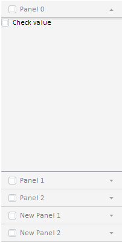

# Master.addMaster

Master.addMaster
-

# Master.addMaster

## Синтаксис

addMaster (master: PP.Ui.[Master](Master.htm),
 beforeItem: PP.Ui.[NavigationItem](dhtmlCommon.chm::/Classes/NavigationItem/NavigationItem.htm));

## Параметры

master. Мастер, панели которого
 будут добавлены;

beforeItem. Элемент, перед
 которым надо вставить панели. Если пусто, то добавится в конец.

## Описание

Метод addMaster добавляет дочерний
 мастер.

## Пример

Для выполнения примера предполагается наличие на странице [мастера](Master.htm)
 с наименованием «master» (см. «[Конструктор
 Master](Constructor_Master.htm)»). Добавим кнопку, при нажатии на которую будет добавляться
 дочерний мастер:

var newMaster = new PP.Ui.Master(//дочерний мастер
{
    Items: [
    {
        Title: "New Panel 1"
    },
    {
        Title: "New Panel 2"
    }]
});
var butAdd = new PP.Ui.Button(//кнопка для добавления дочернего мастера
{
    Content: "Add Master",
    ParentNode: document.body,
    Click: function ()
    {
        master.addMaster(newMaster)
    }
});

После выполнения примера на странице будут добавлена кнопка «Add Master»,
 при нажатии на которую в компонент будет добавлен мастер с двумя вкладками:

См. также:

[Master](Master.htm)

		Справочная
		 система на версию 10.9
		 от 18/08/2025,
		 © ООО «ФОРСАЙТ»,
