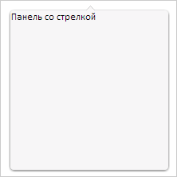

# Пример создания компонента ArrowDropPanel

Пример создания компонента ArrowDropPanel
-

# Пример создания компонента ArrowDropPanel

Для выполнения примера необходимо наличие на html-странице ссылок на
 файл сценария PP.js и файл стилей PP.css. В событие onload тега <body>
 необходимо добавить вызов функции createArrowDropPanel(). Создадим и отобразим
 раскрывающуюся панель со стрелкой и произвольным содержимым:

function createArrowDropPanel() {
    arrowDropPanel = new PP.Ui.ArrowDropPanel({
        // Устанавливаем размеры панели
        Width: 200,
        Height: 200,
        MaxDropDownHeight: 500,
        MaxDropDownWidth: 500,
        MinDropDownHeight: 100,
        MinDropDownWidth: 100,
        // Устанавливаем содержимое панели
        Content: "Панель со стрелкой",
        // Устанавливаем положение стрелки относительно панели
        ArrowPosition: PP.Ui.DropPanelArrowPosition.TopBottom
    });
    // Отображаем панель относительно точки
    arrowDropPanel.showNextControl(new PP.Point(220, 105));
    // Удаляем информацию о положении стрелки на панели.
    arrowDropPanel.correctPosition();
}
В результате в документе будет отображена раскрывающаяся панель со стрелкой
 и содержимым:

См. также:

[ArrowDropPanel](ArrowDropPanel.htm)

		Справочная
		 система на версию 10.9
		 от 18/08/2025,
		 © ООО «ФОРСАЙТ»,
