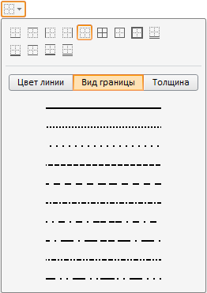
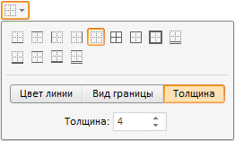

# Пример создания компонента BorderCombo

Пример создания компонента BorderCombo
-

# Пример создания компонента BorderCombo

Для выполнения примера в теге HEAD добавьте ссылки на библиотеку компонентов
 PP.js, визуальные стили PP.css и файл с ресурсами (например, resources.ru.js).
 Далее приведен javascript-код для создания компонента [BorderCombo](BorderCombo.htm).
 Необходимо, чтобы в теге DIV находился элемент с идентификатором «bc1».

var IMAGE_PATH = "../../../../../build/img/"; // Путь к папке с пиктограммами
// Укажем путь к корневой папке, содержащей файлы ресурсов
PP.resourceManager.setRootResourcesFolder("../../../../../resources/");
// Определяем текущие региональные настройки
PP.setCurrentCulture(PP.Cultures.ru);
var borderCombo = new PP.Ui.BorderCombo(        {
    ParentNode: document.getElementById("bc1"),
    // Отображаем панель для изменения толщины линии
    BorderWidthVisible: true,
    // Устанавливаем значение толщины линии
    LineWidth: 4,
    // Отображаем панель для выбора типа границы
    BorderTypeOnlt: true,
    // Открываем вкладку для выбора типа линии
    Mode: 1,
    // Указываем, что доступны типы границ, которые поддерживаются технологией SVG
    TypesMode: "SVG",
    // Выводим новое значение ширины линии после её изменения
    LineWidthChanged: function(sender, args) {
        console.log(args.LineWidth)
    },
    // Устанавливаем обработчик события изменения значения элемента
    ValueChanged: function(sender, args) {
        console.log("Изменилось свойство: " + args.PropertyName);
    }
});

После выполнения примера на html-странице будет размещен компонент [BorderCombo](BorderCombo.htm), имеющий следующий вид:

Активна вкладка «Вид границы». Отображается вкладка «Толщина» (по умолчанию
 она скрыта). В числовом редакторе на вкладке «Толщина» установлено значение
 4:

При смене значения в числовом редакторе в консоль будет выводиться установленное
 значение.

При изменении любого свойства в консоль будет выводиться информации
 об изменении:

Изменилось свойство: LineWidth

Доступна панель для выбора типа границы (сверху), по умолчанию она скрыта.

См. также:

[DHTML-компоненты](dhtml.chm::/DHTML_components.htm)

		Справочная
		 система на версию 10.9
		 от 18/08/2025,
		 © ООО «ФОРСАЙТ»,
