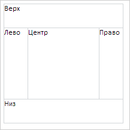

# Пример создания компонента BorderLayout

Пример создания компонента BorderLayout
-

# Пример создания компонента BorderLayout

Для выполнения примера необходимо наличие на html-странице ссылок на
 файл сценария PP.js и файл стилей PP.css, в теге <body> html-страницы
 элемента 
 с идентификатором «borderLayout». В событии onload
 тега <body> необходимо указать вызов функции createBorderLayout().
 Добавляем на страницу компонент [BorderLayout](BorderLayout.htm),
 и заполняем все области подписями с названием этих областей:

function createBorderLayout() {
    // Свойства компонента разметки с границей
    var borderLayoutSettings = {
        // Устанавливаем родительский элемент
        ParentNode: "borderLayout",
        // Устанавливаем ширину
        Width: 200,
        // Устанавливаем высоту
        Height: 200
    }
    borderLayout = new PP.Ui.BorderLayout(borderLayoutSettings);
    // Создаем компонент разметки с границей
    borderLayoutItemCenter = new PP.Ui.BorderLayoutItem({
        // Устанавливаем содержимое
        Content: "Центр",
    });
    // Создаем компонент разметки с границей
    borderLayoutItemTop = new PP.Ui.BorderLayoutItem({
        // Устанавливаем содержимое
        Content: "Верх",
        // Устанавливаем высоту
        Height: 40
    });
    // Создаем компонент разметки с границей
    borderLayoutItemBottom = new PP.Ui.BorderLayoutItem({
        // Устанавливаем содержимое
        Content: "Низ",
        // Устанавливаем высоту
        Height: 40
    });
    // Создаем компонент разметки с границей
    borderLayoutItemRight = new PP.Ui.BorderLayoutItem({
        // Устанавливаем содержимое
        Content: "Право",
        // Устанавливаем ширину
        Width: 40
    });
    // Создаем компонент разметки с границей
    borderLayoutItemLeft = new PP.Ui.BorderLayoutItem({
        // Устанавливаем содержимое
        Content: "Лево",
        // Устанавливаем ширину
        Width: 40
    });
    // Устанавливаем центральную область разметки с границей
    borderLayout.setCenterRegion(borderLayoutItemCenter);
    // Устанавливаем верхнюю область разметки с границей
    borderLayout.setTopRegion(borderLayoutItemTop);
    // Устанавливаем нижнюю область разметки с границей
    borderLayout.setBottomRegion(borderLayoutItemBottom);
    // Устанавливаем правую область разметки с границей
    borderLayout.setRightRegion(borderLayoutItemRight);
    // Устанавливаем левую область разметки с границей
    borderLayout.setRegion(PP.Ui.REGION.Left, borderLayoutItemLeft);
}
В результате выполнения получим разметку с границей, в которой каждая
 область имеет подпись со своим названием:

См. также:

[BorderLayout](BorderLayout.htm)

		Справочная
		 система на версию 10.9
		 от 18/08/2025,
		 © ООО «ФОРСАЙТ»,
