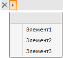

# Пример создания компонента Breadcrumb

Пример создания компонента Breadcrumb
-

# Пример создания компонента Breadcrumb

Для выполнения примера в теге HEAD добавьте ссылки на библиотеки PP.js,
 и визуальный стиль PP.css. В теге BODY добавьте элемент DIV с идентификатором
 «bc1». Предполагается наличие в корневой папке проекта папки с изображениями
 «img» и папки с ресурсами «resources». Создадим компонент [Breadcrumb](Breadcrumb.htm),
 в состав которого входят три элемента.

    //определяем папку с ресурсами
    PP.resourceManager.setRootResourcesFolder("resources/");
    var bread = new PP.Ui.Breadcrumb(
    {
        ParentNode: document.getElementById("bc1"),
        Width: 400,
        ImagePath: "img/",
        Items: [
        {
            Content: "Element1",
            Id: "el1"
        },
        {
            Content: "Element2",
            Id: "el2"
        },
        {
            Content: "Element3",
            Id: "el3"
        }],
        SelectedItems: [0, 1]
    });
    bread.getSelectedItems().remove(1);

После выполнения примера на html-странице будет создан компонент [Breadcrumb](Breadcrumb.htm), имеющий следующий вид:

При нажатии на кнопку  из
 цепочки навигации будет удален выбранный элемент.

При нажатии на кнопку  будет
 раскрыто меню для выбора элементов:

При нажатии на кнопку  будет
 раскрыта история выбора элементов:

В цепочке навигации можно установить элементы из истории выбора.

См. также:

[DHTML-компоненты](dhtml.chm::/DHTML_components.htm)

		Справочная
		 система на версию 10.9
		 от 18/08/2025,
		 © ООО «ФОРСАЙТ»,
