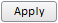

# Пример создания простой кнопки

Пример создания простой кнопки
-

# Пример создания простой кнопки

Для выполнения примера добавьте ссылки на библиотеку PP.js и таблицу визуальных стилей PP.css.

Далее представлен текст javascript-кода, при помощи которого на html-странице размещается кнопка с надписью «Apply»:

После выполнения примера на html-странице будет размещена кнопка, имеющая следующий вид:

Для того чтобы при нажатии на кнопку открывалось окно с надписью «Button Apply is pressed» в javascript код добавляется пользовательский класс «MyClass», реализующий обработчик события «btnOnClick»:

function MyClass(data)

{

      this.data = data;

      this.btnOnClick = function (sender, args)

   {

               alert("Button Apply is pressed");

   }

}

Далее создаем объект класса «MyClass»:

var m = new MyClass("Контекст обработки события верен");

Добавим обработчик события Click в параметры кнопки «MyButton»:

Click: m.btnOnClick

После выполнения примера при нажатии на кнопку с надписью «Apply» появится сообщение «Button Apply is pressed».

См. также:

[Button](Button.htm)

		Справочная
		 система на версию 10.9
		 от 18/08/2025,
		 © ООО «ФОРСАЙТ»,
