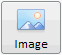

# Пример создания кнопки с изображением

Пример создания кнопки с изображением
-

# Пример создания кнопки с изображением

Для выполнения примера добавьте ссылки на библиотеку PP.js и таблицу
 визуальных стилей PP.css. Файл «ImgBtn1.png» должен храниться на одном
 уровне с html-страницей.

Далее приведен пример javascript-кода, при помощи которого на html-странице
 размещается компонент Button:

После выполнения примера на html-страницу будет добавлена кнопка с изображением,
 имеющая следующий вид:

При двойном щелчке мыши появится сообщение «Button Image is pressed».

См. также:

[Button](Button.htm)

		Справочная
		 система на версию 10.9
		 от 18/08/2025,
		 © ООО «ФОРСАЙТ»,
