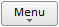
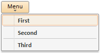

# Пример создания кнопки с раскрывающимся меню

Пример создания кнопки с раскрывающимся меню
-

# Пример создания кнопки с раскрывающимся меню

Для выполнения примера добавьте ссылки на библиотеку PP.js и таблицу визуальных стилей PP.css. Далее приведен текст javascript-кода, с помощью которого создается кнопка с наименованием «Menu»:

После выполнения примера на html-странице будет размещен компонент Button, имеющий следующий вид:

При нажатии на кнопку будет раскрыто меню, состоящее из трех элементов:

См. также:

[Button](Button.htm)

		Справочная
		 система на версию 10.9
		 от 18/08/2025,
		 © ООО «ФОРСАЙТ»,
