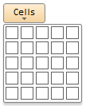

# Пример создания компонента CellPicker

Пример создания компонента CellPicker
-

# Пример создания компонента CellPicker

Для выполнения примера добавьте ссылки на библиотеку PP.js и таблицы визуальных стилей PP.css. Разместим на html-странице кнопку, при нажатии на которую будет раскрыт компонент CellPicker:

После выполнения примера на html-странице будет размещена кнопка, при нажатии на которую будет раскрыта панель, содержащая компонент CellPicker:

См. также:

[CellPicker](CellPicker.htm)

		Справочная
		 система на версию 10.9
		 от 18/08/2025,
		 © ООО «ФОРСАЙТ»,
