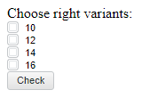

# Пример создания компонента CheckBox

Пример создания компонента CheckBox
-

# Пример создания компонента CheckBox

Для выполнения примера в теге HEAD html-страницы добавьте ссылки на
 следующие js и css-файлы:

	- PP.js;

	- PP.css.

В теге SCRIPT добавьте скрипт для создания компонента [CheckBox](CheckBox.htm):

В теге BODY добавьте элементы с идентификаторами:

<body onload="onLoad()">
    Choose right variants:
    

    

    

    

    

</body>
После выполнения примера на html-странице будут размещены экземпляры
 компонента CheckBox:

Если отметить первый и последний варианты ответа, то на экран будет
 выведено сообщение «Correct» после нажатия на кнопку с надписью «Check»,
 иначе «Sorry! Try again!».

См. также:

[CheckBox](CheckBox.htm)

		Справочная
		 система на версию 10.9
		 от 18/08/2025,
		 © ООО «ФОРСАЙТ»,
