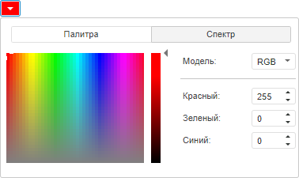

# Пример создания компонента ColorCombo

Пример создания компонента ColorCombo
-

# Пример создания компонента ColorCombo

Перед выполнением примера ознакомьтесь с [рекомендациями](dhtml.chm::/specification/JavaScript_main.htm)
 к написанию кода.

Для создания компонента [ColorCombo](ColorCombo.htm)
 используйте HTML-код:

<!DOCTYPE html PUBLIC "-//W3C//DTD XHTML 1.0 Transitional//EN" "http://www.w3.org/TR/xhtml1/DTD/xhtml1-transitional.dtd">
<html xmlns="http://www.w3.org/1999/xhtml">
<head>
    <meta http-equiv="X-UA-Compatible" content="IE=edge" />
    <meta http-equiv="Content-Type" content="text/html; charset=UTF-8" />
    <title>ColorCombo</title>
    
    <link href="../build/PP.css" rel="stylesheet" type="text/css" />
    

    
</head>
<body onload="createColorCombo()">
    

</body>
</html>

В результате выполнения примера на html-странице будет размещен компонент
 ColorCombo в виде раскрывающегося
 списка для выбора цвета:

См. также:

[ColorCombo](ColorCombo.htm)

		Справочная
		 система на версию 10.9
		 от 18/08/2025,
		 © ООО «ФОРСАЙТ»,
