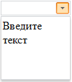

# Пример создания компонента Combo

Пример создания компонента Combo
-

# Пример создания компонента Combo

Для выполнения примера подключите ссылки на библиотеку PP.js и таблицы визуальных стилей PP.css.

Далее приведен javascript-код, необходимый для создания экземпляра компонента Combo.

После выполнения примера на html-странице будет размещен компонент [Combo](Combo.htm). При нажатии на кнопку вызова раскрывающейся панели компонент примет следующий вид:

Поскольку для свойства [EnableEdit](../../Classes/Combo/Combo.EnableEdit.htm) установлено значение true, в строке ввода может быть введен текст:

См. также:

[Combo](Combo.htm)

		Справочная
		 система на версию 10.9
		 от 18/08/2025,
		 © ООО «ФОРСАЙТ»,
