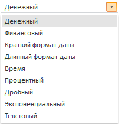

# Пример создания компонента ComboBox

Пример создания компонента ComboBox
-

# Пример создания компонента ComboBox

Для выполнения примера необходимо подключить библиотеку PP.js и таблицы визуальных стилей PP.css. Создадим компонент [ComboBox](ComboBox.htm), состоящий из поля ввода и раскрывающегося списка:

После выполнения примера на html-странице будет размещен компонент [ComboBox](ComboBox.htm). В строке редактирования будет отображаться первый элемент списка. При нажатии на кнопку вызова раскрывающегося списка отобразится список:

См. также:

[ComboBox](ComboBox.htm)

		Справочная
		 система на версию 10.9
		 от 18/08/2025,
		 © ООО «ФОРСАЙТ»,
