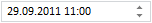
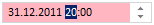

# Пример создания компонента DateTimeEdit

Пример создания компонента DateTimeEdit
-

# Пример создания компонента DateTimeEdit

Для выполнения примера подключите библиотеку компонентов PP.js и таблицы визуальных стилей PP.css. Далее приведен javascript-код, при помощи которого на html-странце будет размещен редактор даты и времени.

<script type="text/javascript">

var date = new Date (2011, 08, 29, 11, 0, 0, 0);//Переменная, содержащая значение установленной даты и времени.

var minDate = new Date(2011, 0, 1, 10, 0, 0, 0);//Переменная, содержащая минимальное значение даты и //времени.

var maxDate = new Date(2011, 11, 31, 19, 0, 0, 0);//Переменная, содержащая максимальное значение даты и //времени.

DTE = new PP.Ui.DateTimeEdit({//Создаем экземпляр компонента.

    ParentNode: document.getElementById("DTE1"),//Идентификатор компонента, который содержится в теге //div.

    CurrentDate: date,//Устанавливаем значение даты.

    Width: 150,//Ширина компонента.

    MinDate: minDate,//Устанавливаем минимальное значение даты и времени.

    MaxDate: maxDate})//Устанавливаем максимальное значение даты и времени.

<script>

После выполнения примера на html-странице будет размещен редактор даты и времени, имеющий следующий вид:

Примечание. Значение месяца устанавливается в диапазоне от 0 до 11: 0 - январь, 11 - декабрь.

Максимальные значения даты и времени, которые возможно установить, - 30.12.2011 19:00. Минимальные значения даты и времени - 1.01.2011 10:00. При попытке установить значение большее или меньшее минимального и максимального загорается индикатор некорректного ввода:

После этого при установке курсора вне области компонента в редакторе будет установлено ближайшее допустимое значение (в данном случае максимальное - 31.12.2011 19:00).

См. также:

[DateTimeEdit](DateTimeEdit.htm)

		Справочная
		 система на версию 10.9
		 от 18/08/2025,
		 © ООО «ФОРСАЙТ»,
