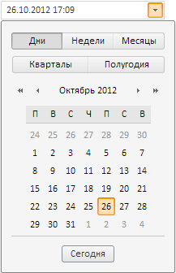

# Пример создания компонента DateTimePicker

Пример создания компонента DateTimePicker
-

# Пример создания компонента DateTimePicker

Для выполнения примера подключите библиотеку компонентов PP.js, визуальные стили PP.css и файл ресурсов (resources.ru.js). В теге BODY добавьте элемент DIV с идентификатором «DTP1». Далее приведен javascript-код, при помощи которого на html-странце будет размещен компонент [DateTimePicker](DateTimePicker.htm):

      //устанавливаем текущую культуру

      PP.setCurrentCulture(PP.Cultures.ru);

      var DTP = new PP.Ui.DateTimePicker(

      {

          ParentNode: document.getElementById("DTP1")

      })

      DTP.setWidth(200)//ширина компонента

      DTP.getCalendar().setShowTime(true); //Устанавливаем видимость элементов для ввода времени в календаре.

      DTP.getDateTimeEdit().setShowTime(true); //Устанавливаем видимость значения времени в поле ввода.

Результат выполнения примера:

См. также:

[DateTimePicker](DateTimePicker.htm)

		Справочная
		 система на версию 10.9
		 от 18/08/2025,
		 © ООО «ФОРСАЙТ»,
