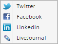

# Пример создания компонента DiscussMenu

Пример создания компонента DiscussMenu
-

# Пример создания компонента DiscussMenu

Для выполнения примера необходимо создать html-страницу и выполнить
 следующие действия:

1. Добавить ссылки на следующие css-файлы: PP.css, PP.Metabase.css.

Также нужно добавить ссылки на js-файлы: PP.js, PP.Metabase.js, resources.ru.js.

Предполагается наличие в корневой папке проекта папки с изображениями
 «img» и папки с ресурсами «resources».

2. Далее в теге <head> необходимо добавить сценарий, который создает
 компонент [DiscussMenu](DiscussMenu.htm):

3. В теге <body> в качестве значения атрибута «onLoad» указать
 имя функции для создания компонента и добавить два элемента 

 с идентификаторами «btn1» и «btn2»:

<body onload="onReady()">
    

    

</body>
После выполнения примера на странице будут размещены кнопки «Поделиться»
 и «Изменить пункты меню». При нажатии на первую будет раскрыто меню:

При нажатии на пункт меню будет выдаваться сообщение «Перед переходом
 на <название социальной сети>». Далее будет осуществляться переход
 на сайт выбранной социальной сети, при этом на экран будет выведено сообщение
 «После перехода на <название социальной сети>».

При нажатии на кнопку «Изменить пункты меню» пункт «LinkedIn», будет
 выделен при наведении мыши, пункт «Facebook» будет неактивен, пункты «Twitter»
 и «LiveJournal» будут скрыты (Компания
 Meta Platforms Inc., владеющая социальной сетью Facebook, признана экстремистской
 организацией, её деятельность на территории России запрещена).

См. также:

[DiscussMenu](DiscussMenu.htm)

		Справочная
		 система на версию 10.9
		 от 18/08/2025,
		 © ООО «ФОРСАЙТ»,
