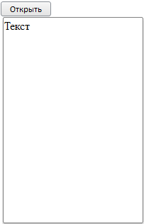

# Пример создания компонента DropPanel

Пример создания компонента DropPanel
-

# Пример создания компонента DropPanel

Подключите библиотеку компонентов PP.js и таблицы визуальных стилей
 PP.css. Для выполнения примера на html-странице требуется наличие двух
 тегов 
 с идентификаторами
 «DP1» и «btn1». Далее приведен javascript-код, при помощи которого на
 html-странце будет размещена раскрывающаяся панель:

var DP = new PP.Ui.DropPanel({
    ParentNode: document.getElementById("DP1"),
    Width: 200,
    Height: 300,
    MaxDropDownHeight: 500,
    MaxDropDownWidth: 500,
    MinDropDownHeight: 100,
    MinDropDownWidth: 100,
    EnableResizeLeft: false,
    EnableResizeTop: false,
    Content: "Текст",
    EnableRestoreFocus: true
});
function ShowPanel()
{
    DP.show(10, 30);
}
var btn = new PP.Ui.Button({ParentNode: document.getElementById("btn1"),
    Click: ShowPanel,
    Content: "Открыть"})
</script>
После выполнения примера при нажатии на кнопку «Открыть»
 на html-странице будет раскрыта панель, имеющая следующий вид:

Размеры панели можно изменять с помощью мыши, захватывая и перетаскивая
 курсором ее границы, при этом курсор будет отображаться в виде двунаправленной
 стрелки. Максимальные и минимальные высота и ширина компонента заданы
 с помощью свойств [DropPanel.MaxDropDownHeight](../../Classes/DropPanel/DropPanel.MaxDropDownHeight.htm),
 [DropPanel.MaxDropDownWidth](../../Classes/DropPanel/DropPanel.MaxDropDownWidth.htm),
 [DropPanel.MinDropDownHeight](../../Classes/DropPanel/DropPanel.MinDropDownHeight.htm)
 и [DropPanel.MinDropDownWidth](../../Classes/DropPanel/DropPanel.MinDropDownWidth.htm).

В данном примере могут изменяться размеры только правой и нижней сторон
 панели, поскольку для свойств [DropPanel.EnableResizeLeft](../../Classes/DropPanel/DropPanel.EnableResizeLeft.htm)
 и [DropPanel.EnableResizeTop](../../Classes/DropPanel/DropPanel.EnableResizeTop.htm)
 установлено значение false.

При открытии панель будет располагаться в 10 пикселях от левого края
 страницы и в 30 пикселях от верхнего края, как это задано в параметрах
 метода [DropPanel.show](../../Classes/DropPanel/DropPanel.show.htm).

См. также:

[DropPanel](DropPanel.htm)

		Справочная
		 система на версию 10.9
		 от 18/08/2025,
		 © ООО «ФОРСАЙТ»,
