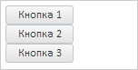
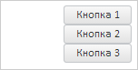

# Пример создания компонента FlexLayout

Пример создания компонента FlexLayout
-

# Пример создания компонента FlexLayout

Для выполнения примера необходимо наличие на html-странице ссылок на
 файл сценария PP.js и файл стилей PP.css, в теге <body> html-документа
 элемента 
 с идентификатором «flexLayout». В событии onload
 тега <body> необходимо указать вызов функции createFlexLayout().
 Добавляем на страницу макет с гибким размещение элементов в контейнере.
 Добавляем в контейнер 3 кнопки:

var flexLayout;
// Создаем макет с гибким размещенеим элементов
function createFlexLayout() {
    flexLayout = new PP.Ui.FlexLayout({
        // Устанавливаем родительский элемент
        ParentNode: document.getElementById("flexLayout"),
        // Добавляем несколько кнопок
        Items: [{ Content: new PP.Ui.Button({ Content: "Кнопка 1" }), Width: 75, Height: 20 },
                { Content: new PP.Ui.Button({ Content: "Кнопка 2" }), Width: 75, Height: 20 },
                { Content: new PP.Ui.Button({ Content: "Кнопка 3" }), Width: 75, Height: 20 }],
        // Устанавливаем размеры
        Width: 139,
        Height: 65
    });
}
В результате будет создан контейнер с 3 кнопками:

Поменяем позицию элементов в контейнере, установив выравнивание по правому
 краю:

// Устанавливаем выравнивание по правому краю
flexLayout.setPosition({Pack: "Start", Align: "Right", Flex: "None"});
// Обновляем макет
flexLayout.updateLayout();
В результате элементы будут выравнены по правому краю контейнера:

См. также:

[FlexLayout](FlexLayout.htm)

		Справочная
		 система на версию 10.9
		 от 18/08/2025,
		 © ООО «ФОРСАЙТ»,
