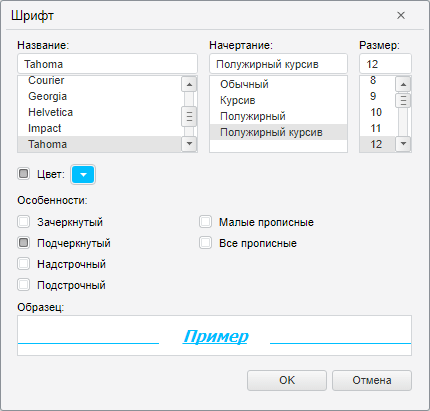

# Пример создания компонента FontDialog

Пример создания компонента FontDialog
-

# Пример создания компонента FontDialog

Для выполнения примера в теге HEAD добавьте ссылки на следующие файлы:

	- библиотека базовых компонентов PP.js;

	- визуальные стили PP.css;

	- модуль с ресурсами resources.ru.js (русские ресурсы) или resources.en.js
	 (английские ресурсы).

В теге SCRIPT добавим следующий скрипт для создания [диалога
 настройки шрифта](FontDialog.htm) и [кнопки](../Button/Button.htm) для вызова
 этого диалога:

        //создаем компонент FontDialog
        var fontdialog = new PP.Ui.FontDialog();
        //текущие настройки шрифта
        fontdialog.setFont(new PP.Font({
            //название
            FontFamily: "Tahoma",
            //размер
            Size: 12,
            //цвет
            Color: "#00BFFF",
            //не используем цвет по умолчанию
            UseAutoColor: false,
            //полужирное начертание
            IsBold: true,
            //курсив

            IsItalic: true,
            //не перечеркнутый
            IsStriken: false,
            //с подчеркиванием
            IsUnderline: true,
            //не надстрочный
            IsSuperior: false,
            //не подстрочный
            IsInferior: false,
            //без использования малых прописных
            IsLowerCapitalized: false,
            //без использования всех прописных
            IsCapitalized: false
        }));

        //устанавливаем текст примера
        fontdialog.setSampleTextString("Пример");
        //кнопка для вызова диалога
        var b = new PP.Ui.Button({
            ParentNode: document.getElementById("but1"),
            Content: "Font dialog",
            Width: 50,
            Height: 20
        });
        b.Click.add(function (sender, args) { fontdialog.show(100, 100) });

После выполнения примера на html-странице будет размещена кнопка «Font
 dialog», при нажатии на которую вызывается диалог для выбора шрифта:

См. также:

[FontDialog](FontDialog.htm)

		Справочная
		 система на версию 10.9
		 от 18/08/2025,
		 © ООО «ФОРСАЙТ»,
