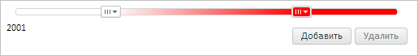

# Пример создания компонента GradientSlider

Пример создания компонента GradientSlider
-

# Пример создания компонента GradientSlider

Для выполнения примера необходимо создать html-страницу и выполнить следующие действия:

1. Добавить ссылку на файлы PP.css, PP.js и resources.ru.js.

2. Внутри тега <body> разместить блок с идентификатором «slider»:

3. Далее на страницу внутри тега <body> необходимо добавить сценарий, который создаёт элемент управления для выбора значения с градиентной заливкой с помощью перемещения бегунков:

В результате выполнения примера на html-странице будет размещен элемент управления для выбора значения с помощью перемещения бегунка с градиентной заливкой:

См. также:

[GradientSlider](GradientSlider.htm)

		Справочная
		 система на версию 10.9
		 от 18/08/2025,
		 © ООО «ФОРСАЙТ»,
