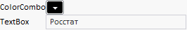

# Пример создания компонента GridPanel

Пример создания компонента GridPanel
-

# Пример создания компонента GridPanel

Для выполнения примера в теге HEAD html-страницы добавьте ссылки на библиотеку PP.js и таблицы визуальных стилей PP.css. Необходимо наличие тега DIV с идентификатором «gp1». Далее приведены примеры динамического и статического размещения компонента [GridPanel](GridPanel.htm), на котором расположены компоненты [ColorCombo](../ColorCombo/ColorCombo.htm), Label и TextBox.

## Пример статического размещения компонента GridPanel

## Пример динамического размещения компонента GridPanel

После выполнения примера на html-странице будет размещен компонент GridPanel, имеющий следующий вид:

См. также:

[GridPanel](GridPanel.htm)

		Справочная
		 система на версию 10.9
		 от 18/08/2025,
		 © ООО «ФОРСАЙТ»,
