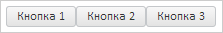

# Пример создания компонента LayoutBox

Пример создания компонента LayoutBox
-

# Пример создания компонента LayoutBox

Для выполнения примера необходимо наличие на html-странице ссылок на
 файлы сценария PP.js и файл стилей PP.css, в теге <body> html-документа
 элемента 
 с идентификатором «layoutBox». В событии onload тега
 <body> необходимо указать вызов функции createLayoutBox(). Добавляем
 на страницу таблицу и заполняем ее элементами:

var layoutBox;
function createLayoutBox() {
    // Создаем временную шкалу
    layoutBox = new PP.Ui.LayoutBox({
        // Устанавливаем родительский элемент
        ParentNode: document.getElementById("layoutBox"),
        // Устанавливаем размеры
        Width: 250,
        // Устанавливаем горизонтальную ориентацию таблицы
        Orientation: "Horizontal",
    });
    // Добавляем несколько кнопок в таблицу
    layoutBox.insert(new PP.Ui.Button({ Content: "Кнопка 1", Height: 21 }), 0);
    layoutBox.add(new PP.Ui.Button({ Content: "Кнопка 2", Height: 21 }));
    layoutBox.add(new PP.Ui.Button({ Content: "Кнопка 3", Height: 21 }));
}
В результате выполнения получим таблицу с 3 кнопками, расположенными
 горизонтально:

Располагаем элементы таблицы вертикально и удаляем 3 кнопку:

// Устанавливаем вертикальную ориентацию
layoutBox.setOrientation("Vertical");
// Удаляем 3 кнопку
layoutBox.removeByIndex(2);
В результате получим таблицу с 2 кнопками, расположенными вертикально:

См. также:

[LayoutBox](LayoutBox.htm)

		Справочная
		 система на версию 10.9
		 от 18/08/2025,
		 © ООО «ФОРСАЙТ»,
