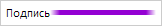

# Пример создания компонента LineLabel

Пример создания компонента LineLabel
-

# Пример создания компонента LineLabel

Для выполнения примера необходимо наличие на html-странице
 ссылок на файл сценария PP.js и файл стилей PP.css, в теге <body>
 html-страницы элемента 
 с идентификатором «lineLabel». В событие onload тега <body>
 необходимо добавить вызов функции createLineLabel(). Добавим на страницу
 подпись с линией:

function createLineLabel() {
    lineLabel = new PP.Ui.LineLabel({
        // Устанавливаем родительский элемент
        ParentNode: document.getElementById("lineLabel"),
        // Устанавливаем содержимое подписи
        Content: "Подпись",
        // Устанавливаем высоту линии
        LineHeight: 5,
        // Устанавливаем размытость линии
        IsLineBlur: true,
        // Устанавливаем ширину размытости по краям линии
        LineBlurWidth: 10,
        // Устанавливаем цвет линии
        LineColor: PP.Color.Colors.darkviolet
    });
}
В результате на страницу будет добавлена подпись с линией:

См. также:

[LineLabel](LineLabel.htm)

		Справочная
		 система на версию 10.9
		 от 18/08/2025,
		 © ООО «ФОРСАЙТ»,
