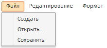

# Пример создания компонента MainMenu

Пример создания компонента MainMenu
-

# Пример создания компонента MainMenu

Для выполнения примера в теге HEAD добавьте ссылки на библиотеку PP.js
 и визуальные стили PP.css. Предполагается наличие на странице элемента
 DIV с идентификатором «mm1», куда будет помещено [главное
 меню](MainMenu.htm). Далее приведен пример создания [главного
 меню](MainMenu.htm), состоящего из трех [кнопок](../../Classes/MainMenuButton/MainMenuButton.htm):

    //меню
 для первой кнопки главного меню

    var menu0 = new PP.Ui.Menu({

            //событие выбора пункта меню

             ItemSelected:
 onItemClick,

            //пункты меню

             Items:
 [

   { MenuItem: { Content: "Создать"}
 },

   { MenuItem: { Content: "Открыть..."}
 },

   { MenuItem: { Content: "Сохранить"}
 }

   ]

    });

    //кнопки
 главного меню

    var mainMenuButton0 = new
 PP.Ui.MainMenuButton({

             Content:
 "Файл",

             //меню для кнопки

             Menu:
 menu0

             });

    var mainMenuButton1 = new
 PP.Ui.MainMenuButton({Content: "Редактирование"});

    var mainMenuButton2 = new
 PP.Ui.MainMenuButton({Content: "Формат"});

    //главное
 меню

    var mainMenu = new PP.Ui.MainMenu({

        ParentNode:
 document.getElementById("mm1"),

        //кнопки главного меню

        Items:
 [mainMenuButton0, mainMenuButton1, mainMenuButton2]

    });

    //ширина
 главного меню

    mainMenu.setWidth(300)

    //обработчик
 события выбора пункта меню

    function onItemClick(item,
 args){

        var
 id = item.getId();

        alert("Выбран
 пункт «" + mainMenu.getItemById(id).getContent()+ "»");

    }

После выполнения примера на html-странице будет размещен компонент [MainMenu](MainMenu.htm), имеющий следующий вид:

Компонент включает в себя три кнопки. При нажатии на кнопку «Файл» раскрывается
 меню, состоящее из трех элементов. При выборе любого из этих элементов
 на экран будет выводиться сообщение «Выбран пункт <название пункта>».

		Справочная
		 система на версию 10.9
		 от 18/08/2025,
		 © ООО «ФОРСАЙТ»,
