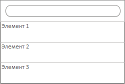

# Пример создания компонента MainPanel

Пример создания компонента MainPanel
-

# Пример создания компонента MainPanel

Для выполнения примера необходимо наличие на html-странице
 ссылок на файлы сценариев PP.js, PP.Ext.js и файлы стилей PP.css и PP.Ext.css. В событие onload
 тега <body> необходимо добавить вызов функции createMainPanel().
 Создаем раскрывающуюся панель с меню и отображаем ее:

function createMainPanel() {
    // Создаем панель с меню
    mainPanel = new PP.Ui.MainPanel({
        // Устанавливаем признак отображения строки поиска элементов
        SearchVisible: true,
        // Добавляем элементы
        Items: [
            {
                HotKey: "Элемент 1"
            },
            {
                HotKey: "Элемент 2"
            },
            {
                HotKey: "Элемент 3"
            }
        ]
    });

    // Отображаем панель с меню
    mainPanel.show(10, 10);
}
В результате будет отображена раскрывающаяся панель с меню:

См. также:

[MainPanel](MainPanel.htm)

		Справочная
		 система на версию 10.9
		 от 18/08/2025,
		 © ООО «ФОРСАЙТ»,
