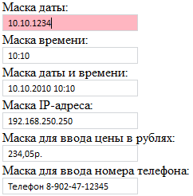

# Пример создания компонента MaskEdit

Пример создания компонента MaskEdit
-

# Пример создания компонента MaskEdit

Для выполнения примера подключите к html-странице ссылки на библиотеку PP.js и таблицы визуальных стилей PP.css. Создадим редакторы, предназначенные для ввода различных видов данных.

<body>

Маска даты:

Маска времени:

Маска даты и времени:

Маска IP-адреса:

Маска для ввода цены в рублях:

Маска для ввода номера телефона:

</body>

После выполнения примера на html-странице будут размещены редакторы с шаблонами для ввода даты, времени, даты и времени, ip-адреса, цены в рублях и номера телефона c установленными значениями. Если попробовать ввести в редактор значение, не соответствующее регулярному выражению, то загорится индикатор некорректного ввода:

См. также:

[MaskEdit](MaskEdit.htm)

		Справочная
		 система на версию 10.9
		 от 18/08/2025,
		 © ООО «ФОРСАЙТ»,
