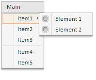
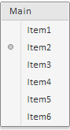

# Пример создания компонента Menu

Пример создания компонента Menu
-

# Пример создания компонента Menu

Для выполнения примера в теге HEAD добавьте ссылки на библиотеку PP.js и визуальные стили PP.css. далее приведен пример статического создания компонента [Menu](Menu.htm), состоящего из заголовка, шести пунктов и разделителя между третьим и четвертым пунктами:

<body>

Item6

</body>

После выполнения примера при нажатии на кнопку «Show», будет раскрыто меню, имеющее следующий вид:

Меню состоит из ,[заголовка](../../Classes/MenuHeader/MenuHeader.htm) «Main», [разделителя](../../Classes/Separator/Separator.htm) (между третьим и четвертым элементов) и шести [пунктов](../../Classes/MenuItem/MenuItem.htm). Первые три пункта являются экземплярами класса [MenuItem](../../Classes/MenuItem/MenuItem.htm), четвертый - текст, пятый представлен html-разметкой, шестой - DOM-вершиной.

Для первого пункта при помощи свойства [Menu](../../Classes/MenuItem/MenuItem.Menu.htm) установлено подменю, состоящее из двух пунктов, для каждого из которых при помощи свойства [Checked](../../Classes/MenuItem/MenuItem.Checked.htm) установлен [флажок](../CheckBox/CheckBox.htm).

Для второго и третьего элемента меню при помощи свойства [GroupName](../../Classes/MenuItem/MenuItem.GroupName.htm) установлено общее имя группы. Это означает, что для данных элементов настроен [переключатель](../RadioButton/RadioButton.htm), который устанавливается при выборе элемента:

Одновременно может быть установлен только один переключатель: или для «Item2», или для «Item3».

См. также:

[Menu](Menu.htm)

		Справочная
		 система на версию 10.9
		 от 18/08/2025,
		 © ООО «ФОРСАЙТ»,
