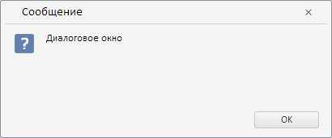

# Пример создания компонента Message

Пример создания компонента Message
-

# Пример создания компонента Message

Для выполнения примера необходимо наличие на html-странице ссылки на
 файлы PP.js и PP.css. Для отображения пиктограммы окна необходимо
 иметь ссылку на файл "question.png". В событии onload тега <body>
 необходимо указать вызов функции createMessage():

function createMessage() {
    // Устанавливаем путь к ресурсам
    PP.resourceManager.setRootResourcesFolder("../build/resources/");
    // Устанавливаем культуру
    PP.setCurrentCulture(PP.Cultures.ru);
    // Создаем окно
    message = new PP.Ui.Message({
        // Устанавливаем пользовательский тип окна
        Type: "Custom",
        // Устанавливаем путь к файлу с пиктограммой
        ImageUrl: "../build/img/question.png",
        // Содержимое окна
        Content: "окно",
        // Кнопки
        Buttons: PP.Ui.MessageButtons.Ok
    });
    message.show();
}
В результате на экран будет выведено окно:

См. также:

[Message](Message.htm)

		Справочная
		 система на версию 10.9
		 от 18/08/2025,
		 © ООО «ФОРСАЙТ»,
