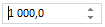

# NumberEdit

NumberEdit
-

**

# NumberEdit

## Описание

Компонент NumberEdit представляет
 собой числовой редактор с кнопками прокрутки.

## Комментарии

Компонент реализован классом [NumberEdit](../../Classes/NumberEdit/NumberEdit.htm),
 наследником класса [SpinEdit](dhtmlCommon.chm::/Classes/SpinEdit/SpinEdit.htm).

## Пример

Компонент имеет следующий вид:

Изменять значение в редакторе можно с помощью кнопок прокрутки, клавиш
 UP/DOWN или путем ввода значения с клавиатуры.

Для компонента можно определить, какие символы будут использоваться
 в качестве [разделителя
 разрядов](../../Classes/NumberEdit/NumberEdit.DecimalSeparator.htm) и [разделителя
 тысяч](../../Classes/NumberEdit/NumberEdit.GroupSeparator.htm). Кроме того, можно установить [количество
 символов после запятой](../../Classes/NumberEdit/NumberEdit.FractionCount.htm), [минимальное](../../Classes/NumberEdit/NumberEdit.MinValue.htm)
 и [максимальное](../../Classes/NumberEdit/NumberEdit.MaxValue.htm)
 допустимые значения, [шаг](../../Classes/NumberEdit/NumberEdit.Step.htm),
 с которым будет изменяться значение при нажатии клавиш UP/DOWN или
 кнопок прокрутки.

[Пример создания компонента NumberEdit](Example_NumberEdit.htm)

## Конструктор

			 Имя конструктора
			 Краткое описание

			 
			 [NumberEdit](dhtmlUi.chm::/classes/numberedit/constructor_numberedit.htm)
			 Конструктор NumberEdit
			 создает экземпляр компонента NumberEdit.

## Свойства

		 Имя свойства
		 Краткое описание

		 
		 [DecimalSeparator](dhtmlUi.chm::/classes/numberedit/numberedit.decimalseparator.htm)
		 Свойство DecimalSeparator
		 устанавливает символ разделителя разрядов.

		 
		 [EnableGroupSeparator](dhtmlUi.chm::/Classes/NumberEdit/NumberEdit.EnableGroupSeparator.htm)
		 Свойство EnableGroupSeparator
		 определяет разделение групп разрядов.

		 
		 [FractionCount](dhtmlUi.chm::/classes/numberedit/numberedit.fractioncount.htm)
		 Свойство FractionCount
		 устанавливает количество знаков после [разделителя
		 разрядов](dhtmlUi.chm::/classes/numberedit/numberedit.decimalseparator.htm).

		 
		 [GroupSeparator](dhtmlUi.chm::/classes/numberedit/numberedit.groupseparator.htm)
		 Свойство GroupSeparator
		 устанавливает разделитель тысяч.

		 
		 [MaxValue](dhtmlUi.chm::/classes/numberedit/numberedit.maxvalue.htm)
		 Свойство MaxValue устанавливает
		 максимальное допустимое значение компонента.

		 
		 [MinValue](dhtmlUi.chm::/classes/numberedit/numberedit.minvalue.htm)
		 Свойство MinValue устанавливает
		 минимальное допустимое значение компонента.

		 
		 [Prefix](dhtmlUi.chm::/Classes/NumberEdit/NumberEdit.Prefix.htm)
		 Свойство Prefix устанавливает
		 префикс для значения в компоненте.

		 
		 [Step](dhtmlUi.chm::/classes/numberedit/numberedit.step.htm)
		 Свойство Step определяет
		 размер шага, с которым изменяется значение компонента.

		 
		 [Suffix](dhtmlUi.chm::/Classes/NumberEdit/NumberEdit.Suffix.htm)
		 Свойство Suffix устанавливает
		 суффикс для значения в компоненте.

		 
		 [Value](dhtmlUi.chm::/classes/numberedit/numberedit.value.htm)
		 Свойство Value устанавливает
		 числовое значение компонента.

		 
		 [Walkthrough](dhtmlUi.chm::/classes/numberedit/numberedit.walkthrough.htm)
		 Свойство Walkthrough
		 определяет, является ли прокрутка значения цикличной.

## Методы

		 Имя метода
		 Краткое описание

		 
		 [getUnroundValue](dhtmlUi.chm::/Classes/NumberEdit/NumberEdit.getUnroundValue.htm)
		 Метод getUnroundValue
		 возвращает числовое значение компонента без округления в строковом
		 виде.

## События

		 Имя события
		 Краткое описание

		 
		 [AfterValueChange](dhtmlUi.chm::/classes/numberedit/numberedit.aftervaluechange.htm)
		 Событие AfterValueChange наступает
		 после изменения значения компонента.

		 
		 [Validate](dhtmlUi.chm::/classes/numberedit/numberedit.validate.htm)
		 Событие Validate наступает
		 во время проверки корректности введённых данных.

## Свойства, унаследованные от класса [SpinEdit](dhtmlCommon.chm::/Classes/SpinEdit/SpinEdit.htm)

		 Имя свойства
		 Краткое описание

		 
		 [ShowButtons](dhtmlCommon.chm::/classes\spinedit\spinedit.showbuttons.htm)
		 Свойство ShowButtons
		 определяет, используются ли кнопки для переключения значений
		 в компоненте.

## Метод, унаследованный от класса [SpinEdit](dhtmlCommon.chm::/Classes/SpinEdit/SpinEdit.htm)

		 Имя метода
		 Краткое описание

		 
		 [setFocus](dhtmlCommon.chm::/classes/spinedit/spinedit.setfocus.htm)
		 Метод setFocus устанавливает
		 фокус для компонента.

## События, унаследованные от класса [SpinEdit](dhtmlCommon.chm::/Classes/SpinEdit/SpinEdit.htm)

		  Имя события
		 Краткое описание

		 
		 [AfterChange](dhtmlCommon.chm::/classes\spinedit\spinedit.afterchange.htm)
		 Событие AfterChange наступает
		 при завершении изменения текста в поле ввода.

		 
		 [BeforeChange](dhtmlCommon.chm::/classes\spinedit\spinedit.beforechange.htm)
		 Событие BeforeChange наступает
		 в начале изменения текста в поле ввода.

		 
		 [SpinDown](dhtmlCommon.chm::/classes\spinedit\spinedit.spindown.htm)
		 Событие SpinDown наступает
		 при прокрутке вниз.

		 
		 [SpinUp](dhtmlCommon.chm::/classes\spinedit\spinedit.spinup.htm)
		 Событие SpinUp наступает
		 при прокрутке вверх.

## Свойства, унаследованные от класса [TextBox](../../Classes/TextBox/TextBox.htm)

		 Имя свойства
		 Краткое описание

		 
		 [EnableEdit](dhtmlUi.chm::/Classes/TextBox/textBox.EnableEdit.htm)
		 Свойство EnableEdit**
		 определяет, разрешено ли редактирование [текстового поля](dhtmlUi.chm::/Classes/TextBox/TextBox.htm).

		 
		 [IsPassword](dhtmlUi.chm::/Classes/TextBox/textBox.IsPassword.htm)
		 Свойство **IsPassword**
		 определяет признак замены введенного текста звездочками.

		 
		 [IsWatermark](dhtmlUi.chm::/Classes/TextBox/textBox.IsWatermark.htm)
		 Свойство **IsWatermark**
		 определяет признак отрисовки прозрачного текста, если [текстовое поле](dhtmlUi.chm::/Classes/TextBox/TextBox.htm)
		 пустое и не имеет фокуса.

		 
		 [MaxLength](dhtmlUi.chm::/Classes/TextBox/textBox.MaxLength.htm)
		 Свойство **MaxLength определяет максимальную длину текста
		 в [текстовом
		 поле](dhtmlUi.chm::/Classes/TextBox/TextBox.htm)**.

		 
		 [ValidState](dhtmlUi.chm::/Classes/TextBox/textBox.ValidState.htm)
		 Свойство **ValidState**
		 определяет состояние [текстового поля](dhtmlUi.chm::/Classes/TextBox/TextBox.htm)
		 как корректно или некорректно заполненное, устанавливая соответствующую
		 подсветку.

		 
		 [WatermarkText](dhtmlUi.chm::/Classes/TextBox/textBox.WatermarkText.htm)
		 Свойство **WatermarkText**
		 определяет текст, который будет отображаться, если [текстовое поле](dhtmlUi.chm::/Classes/TextBox/TextBox.htm)
		 пустое и не имеет фокуса.

## Методы, унаследованные от класса [TextBox](../../Classes/TextBox/TextBox.htm)

		 Имя метода
		 Краткое описание

		 
		 [applyNotValidCSS](dhtmlUi.chm::/Classes/TextBox/textBox.applyNotValidCSS.htm)
		 Метод **applyNotValidCSS**
		 устанавливает стиль, определяющий подсветку некорректно введенного
		 значения [текстового
		 поля](dhtmlUi.chm::/Classes/TextBox/TextBox.htm).

		 
		 [applyValidCSS](dhtmlUi.chm::/Classes/TextBox/textBox.applyValidCSS.htm)
		 Метод **applyValidCSS**
		 устанавливает стиль, определяющий подсветку корректно введенного
		 значения [текстового
		 поля](dhtmlUi.chm::/Classes/TextBox/TextBox.htm).

		 
		 [blur](dhtmlUi.chm::/Classes/TextBox/TextBox.blur_M.htm)
		 Метод blur снимает
		 фокус с [текстового
		 поля](dhtmlUi.chm::/Classes/TextBox/TextBox.htm).

		 
		 [selectAll](dhtmlUi.chm::/Classes/TextBox/textBox.selectAll.htm)
		 Метод **selectAll**
		 выделяет всё текстовое содержимое [текстового поля](dhtmlUi.chm::/Classes/TextBox/TextBox.htm).

		 
		 [setAllowedSymbols](dhtmlUi.chm::/Classes/TextBox/textBox.setAllowedSymbols.htm)
		 Метод **setAllowedSymbols**
		 устанавливает список символов, разрешенных к вводу.

		 
		 [setRestrictedSymbols](dhtmlUi.chm::/Classes/TextBox/textBox.setRestrictedSymbols.htm)
		 Метод **setRestrictedSymbols**
		 устанавливает список символов, запрещенных к вводу.

## События, унаследованные от класса [TextBox](../../Classes/TextBox/TextBox.htm)

		 Имя события
		 Краткое описание

		 
		 [AfterChange](dhtmlUi.chm::/Classes/TextBox/textBox.AfterChange.htm)
		 Событие **AfterChange**
		 наступает после окончания редактирования [текстового поля](dhtmlUi.chm::/Classes/TextBox/TextBox.htm).

		 
		 [AfterTimeout](dhtmlUi.chm::/Classes/TextBox/textBox.AfterTimeout.htm)
		 Событие **AfterTimeout**
		 наступает после окончания редактирования [текстового поля](dhtmlUi.chm::/Classes/TextBox/TextBox.htm)
		 по истечении времени задержки между редактированием поля и вызовом
		 события.

		 
		 [BeforeChange](dhtmlUi.chm::/Classes/TextBox/textBox.BeforeChange.htm)
		 Событие **BeforeChange**
		 наступает при начале редактирования [текстового поля](dhtmlUi.chm::/Classes/TextBox/TextBox.htm).

		 
		 [Blur](dhtmlUi.chm::/Classes/TextBox/textBox.Blur_E.htm)
		 Событие **Blur**
		 наступает при потере фокуса [текстовым полем](dhtmlUi.chm::/Classes/TextBox/TextBox.htm).

		 
		 [Enter](dhtmlUi.chm::/Classes/TextBox/textBox.Enter.htm)
		 Событие **Enter**
		 наступает при нажатии клавиши ENTER в активном [текстовом поле](dhtmlUi.chm::/Classes/TextBox/TextBox.htm).

		 
		 [Focus](dhtmlUi.chm::/Classes/TextBox/textBox.Focus.htm)
		 Событие **Focus**
		 наступает при получении фокуса [текстовым полем](dhtmlUi.chm::/Classes/TextBox/TextBox.htm).

		 
		 [TextChanged](dhtmlUi.chm::/Classes/TextBox/textBox.TextChanged.htm)
		 Событие **TextChanged наступает после изменения текста
		 [текстового
		 поля](dhtmlUi.chm::/Classes/TextBox/TextBox.htm)**.

		 
		 [ValueChanged](dhtmlUi.chm::/Classes/TextBox/TextBox.ValueChanged.htm)
		 Событие ValueChanged
		 наступает после изменения значения [текстового поля](dhtmlUi.chm::/Classes/TextBox/TextBox.htm).

## Свойства, унаследованные от класса [Control](../../Classes/Control/Control.htm)

		 Имя свойства
		 Краткое описание

		 
		 [Anchors](dhtmlUi.chm::/Classes/Control/Control.Anchors.htm)
		 Свойство Anchors определяет
		 позицию компонента, размещенного внутри контейнера.

		 
		 [Animation](dhtmlUi.chm::/Classes/Control/Control.Animation.htm)
		 Свойство Animation
		 определяет параметры анимации для компонента.

		 
		 [Bottom](dhtmlUi.chm::/Classes/Control/Control.Bottom.htm)
		 Свойство Bottom определяет
		 отступ снизу при размещении компонента внутри LayoutPanel.

		 
		 [Content](dhtmlUi.chm::/classes\control\control.content.htm)
		 Свойство Content определяет
		 содержимое компонента.

		 
		 [ContextMenu](dhtmlUi.chm::/Classes\Control\Control.ContextMenu.htm)
		 Свойство ContextMenu
		 определяет контекстное меню для компонента.

		 
		 [Data](dhtmlUi.chm::/Classes/Control/Control.Data.htm)
		 Свойство Data предназначено
		 для хранения любых пользовательских данных.

		 
		 [Enabled](dhtmlUi.chm::/classes\control\control.enabled.htm)
		 Свойство Enabled определяет
		 признак доступности компонента для использования.

		 
		 [Height](dhtmlUi.chm::/classes\control\control.height.htm)
		 Свойство Height определяет
		 высоту компонента.

		 
		 [IsRTL](dhtmlUi.chm::/classes\control\control.isrtl.htm)
		 Свойство IsRTL определяет
		 признак расположения элементов компонента по правому краю.

		 
		 [IsVisible](dhtmlUi.chm::/Classes/Control/Control.IsVisible.htm)
		 Свойство IsVisible
		 определяет признак отображения компонента.

		 
		 [Left](dhtmlUi.chm::/Classes/Control/Control.Left.htm)
		 Свойство Left определяет
		 отступ слева при размещении компонента внутри [GridPanel](dhtmlUi.chm::/Components/GridPanel/GridPanel.htm).

		 
		 [Opacity](dhtmlUi.chm::/Classes/Control/Control.Opacity.htm)
		 Свойство Opacity определяет
		 прозрачность компонента.

		 
		 [Parent](dhtmlUi.chm::/Classes/Control/Control.Parent.htm)
		 Свойство Parent определяет
		 родительский компонент элемента управления.

		 
		 [ParentNode](dhtmlUi.chm::/Classes/Control/Control.ParentNode.htm)
		 Свойство ParentNode
		 определяет родительскую DOM-вершину.

		 
		 [ResourceKey](dhtmlUi.chm::/classes\control\control.resourcekey.htm)
		 Свойство ResourceKey
		 определяет ресурсный ключ для компонента.

		 
		 [Right](dhtmlUi.chm::/Classes/Control/Control.Right.htm)
		 Свойство Right определяет
		 отступ справа при размещении компонента внутри LayoutPanel.

		 
		 [Rotate](dhtmlUi.chm::/Classes/Control/Control.Rotate.htm)
		 Свойство Rotate определяет
		 угол поворота компонента.

		 
		 [ShowToolTip](dhtmlUi.chm::/Classes/Control/Control.ShowToolTip.htm)
		 Свойство ShowToolTip
		 определяет признак возможности отображения [всплывающей
		 подсказки](dhtmlUi.chm::/Classes/Control/Control.ToolTip.htm) компонента.

		 
		 [Style](dhtmlUi.chm::/Classes/Control/Control.Style.htm)
		 Свойство Style определяет
		 стиль для компонента.

		 
		 [TabIndex](dhtmlUi.chm::/classes\control\control.tabindex.htm)
		 Свойство TabIndex определяет
		 последовательность перехода элемента управления внутри контейнера.

		 
		 [Tag](dhtmlUi.chm::/Classes/Control/Control.Tag.htm)
		 Свойство Tag определяет
		 JSON-объект, ассоциированный с компонентом.

		 
		 [ToolTip](dhtmlUi.chm::/classes\control\control.tooltip.htm)
		 Свойство ToolTip определяет
		 текст всплывающей подсказки компонента.

		 
		 [Top](dhtmlUi.chm::/Classes/Control/Control.Top.htm)
		 Свойство Top определяет
		 отступ сверху при размещении компонента внутри [GridPanel](dhtmlUi.chm::/Components/GridPanel/GridPanel.htm).

		 
		 [Value](dhtmlUi.chm::/classes\control\control.value.htm)
		 Свойство Value определяет
		 значение компонента.

		 
		 [Width](dhtmlUi.chm::/classes\control\control.width.htm)
		 Свойство Width определяет
		 ширину компонента.

## Методы, унаследованные от класса [Control](../../Classes/Control/Control.htm)

		 Имя метода
		 Краткое описание

		 
		 [addClass](dhtmlUi.chm::/classes\control\control.addclass.htm)

		 Метод addClass добавляет
		 CSS-класс к компоненту.

		 
		 [addEventHandler](dhtmlUi.chm::/Classes/Control/Control.addEventHandler.htm)
		 Метод addEventHandler
		 добавляет обработчик события на DOM-вершину.

		 
		 [addStateClass](dhtmlUi.chm::/Classes/Control/Control.addStateClass.htm)

		 Метод addStateClass
		 добавляет CSS-класс к компоненту и удаляет прежний CSS-класс.

		 
		 [addToNode](dhtmlUi.chm::/classes\control\control.addtonode.htm)

		 Метод addToNode добавляет
		 компонент в указанную вершину.

		 
		 [bindEvents](dhtmlUi.chm::/Classes/Control/Control.bindEvents.htm)
		 Метод bindEvents подписывает
		 элемент на все стандартные события.

		 
		 [getAnchorFlags](dhtmlUi.chm::/Classes/Control/Control.getAnchorFlags.htm)

		 Метод getAnchorFlags
		 возвращает JSON-объект с настройками текущей позиции компонента.

		 
		 [getClass](dhtmlUi.chm::/classes\control\control.getclass.htm)

		 Метод getClass возвращает
		 текущие css-классы компонента.

		 
		 [getCssStyle](dhtmlUi.chm::/Classes/Control/Control.getCssStyle.htm)

		 Метод getCssStyle возвращает
		 стили для указанной вершины.

		 
		 [getDomNode](dhtmlUi.chm::/Classes/Control/Control.getDomNode.htm)

		 Метод getDomNode возвращает
		 главную DOM-вершину компонента.

		 
		 [getFocused](dhtmlUi.chm::/Classes/Control/Control.getFocused.htm)

		 Метод getFocused определяет
		 наличие фокуса у компонента.

		 
		 [getIsBinded](dhtmlUi.chm::/Classes/Control/Control.getIsBinded.htm)
		 Метод getIsBinded возвращает
		 признак подписи элемента на события DOM-вершины.

		 
		 [hide](dhtmlUi.chm::/classes\control\control.hide.htm)

		 Метод hide скрывает
		 элемент управления.

		 
		 [hideToolTip](dhtmlUi.chm::/Classes/Control/Control.hideToolTip.htm)

		 Метод hideToolTip очищает
		 таймаут появления подсказки и скрывает её, если она был показана.

		 
		 [refreshStyle](dhtmlUi.chm::/Classes/Control/Control.refreshStyle.htm)
		 Метод refreshStyle
		 обновляет CSS-стили элемента.

		 
		 [removeClass](dhtmlUi.chm::/classes\control\control.removeclass.htm)

		 Метод removeClass удаляет
		 CSS-класс из компонента.

		 
		 [removeEventHandler](dhtmlUi.chm::/Classes/Control/Control.removeEventHandler.htm)
		 Метод removeEventHandler
		 удаляет обработчик события DOM-вершины.

		 
		 [removeFromDOM](dhtmlUi.chm::/classes/control/control.removefromdom.htm)
		 Метод removeFromDOM
		 удаляет вершину из DOM-структуры.

		 
		 [removeStateClasses](dhtmlUi.chm::/Classes/Control/Control.removeStateClasses.htm)

		 Метод removeStateClasses
		 удаляет CSS-классы компонента.

		 
		 [setDraggable](dhtmlUi.chm::/classes\control\control.setdraggable.htm)

		 Метод setDraggable
		 устанавливает возможность перетаскивания компонента на HTML-странице.

		 
		 [setFocus](dhtmlUi.chm::/Classes/Control/Control.setFocus.htm)

		 Метод setFocus устанавливает
		 фокус компонента.

		 
		 [setIsHovered](dhtmlUi.chm::/Classes/Control/Control.setIsHovered.htm)

		 Метод setIsHovered
		 настраивает отображение компонента только при наведении на него
		 курсора.

		 
		 [setSize](dhtmlUi.chm::/classes\control\control.setsize.htm)

		 Метод setSize устанавливает
		 размеры компонента.

		 
		 [show](dhtmlUi.chm::/classes/control/control.show.htm)

		 Метод show отображает
		 элемент управления.

		 
		 [unBindEvents](dhtmlUi.chm::/Classes/Control/Control.unBindEvents.htm)
		 Метод unBindEvents
		 отписывает элемент от всех стандартных событий.

		 
		 [updatePosition](dhtmlUi.chm::/Classes/Control/Control.updatePosition.htm)

		 Метод updatePosition
		 корректирует размер и положение при абсолютном позиционировании
		 на основе текущих параметров.

		 
		 [updateSize](dhtmlUi.chm::/classes\control\control.updatesize.htm)

		 Метод updateSize обновляет
		 размеры компонента подгонке размеров контейнера, в котором находится
		 компонент.

## События, унаследованные от класса [Control](../../Classes/Control/Control.htm)

		 Имя события
		 Краткое описание

		 
		 [Drag](dhtmlUi.chm::/classes\control\control.drag.htm)
		 Событие Drag наступает
		 при нажатии и удерживании кнопки мыши.

		 
		 [DragEnd](dhtmlUi.chm::/classes\control\control.dragend.htm)
		 Событие DragEnd наступает
		 при окончании перетаскивания компонента.

		 
		 [DragStart](dhtmlUi.chm::/classes\control\control.dragstart.htm)
		 Событие DragStart наступает,
		 когда начинается перетаскивание компонента.

		 
		 [OnContextMenu](dhtmlUi.chm::/classes\control\control.OnContextMenu.htm)
		 Событие OnContextMenu
		 наступает при вызове контекстного меню компонента.

		 
		 [SizeChanged](dhtmlUi.chm::/Classes/Control/Control.SizeChanged.htm)
		 Событие SizeChanged
		 наступает после изменения размеров компонента.

		 
		 [SizeChanging](dhtmlUi.chm::/Classes/Control/Control.SizeChanging.htm)
		 Событие SizeChanging
		 наступает во время изменения размеров компонента.

## Свойства, унаследованные от класса [Object](dhtmlCommon.chm::/Classes/object/object.htm)

		 Имя свойства
		 Краткое описание

		 
		 [Id](dhtmlCommon.chm::/classes\object\object.id.htm)

		 Свойство Id определяет
		 идентификатор объекта репозитория.

## Методы, унаследованные от класса [Object](dhtmlCommon.chm::/Classes/object/object.htm)

		 Имя метода
		 Краткое описание

		 
		 [clone](dhtmlCommon.chm::/classes\object\object.clone.htm)
		 Метод clone создает
		 копию объекта.

		 
		 [dispose](dhtmlCommon.chm::/classes\object\object.dispose.htm)
		 Метод dispose уничтожает
		 компонент.

		 
		 [getHashCode](dhtmlCommon.chm::/Classes/Object/Object.getHashCode.htm)
		 Метод getHashCode возвращает
		 хеш-код объекта репозитория.

		 
		 [getId](dhtmlCommon.chm::/Classes/Object/Object.Id.htm)
		 Метод getId возвращает
		 идентификатор объекта репозитория.

		 
		 [getSettings](dhtmlCommon.chm::/Classes/Object/Object.getSettings.htm)
		 Метод getSettings возвращает
		 настройки объекта репозитория.

		 
		 [getTypeName](dhtmlCommon.chm::/classes\object\object.gettypename.htm)
		 Метод getTypeName возвращает
		 имя типа объекта без пространства имен, к которому он принадлежит.

		 
		 [isEqual](dhtmlCommon.chm::/Classes/Object/Object.isEqual.htm)
		 Метод isEqual определяет,
		 равен ли заданный объект текущему объекту репозитория.

		 
		 [isLive](dhtmlCommon.chm::/Classes/Object/Object.isLive.htm)
		 Метод isLive определяет
		 действительность объекта репозитория.

		 
		 [removeAllEvents](dhtmlCommon.chm::/Classes/Object/Object.removeAllEvents.htm)
		 Метод removeAllEvents
		 удаляет все обработчики событий объекта по заданному контексту.

		 
		 [setId](dhtmlCommon.chm::/Classes/Object/Object.Id.htm)
		 Метод setId определяет
		 идентификатор объекта репозитория.

		 
		 [setSettings](dhtmlCommon.chm::/Classes/Object/Object.setSettings.htm)
		 Метод setSettings задает
		 настройки объекта репозитория.

		 
		 [defineProps](dhtmlCommon.chm::/Classes/Object/Object.defineProps.htm)
		 Метод defineProps создает
		 методы get и set из массива имен для указанного класса.

		 
		 [keys](dhtmlCommon.chm::/Classes/Object/Object.keys.htm)
		 Метод keys возвращает
		 массив названий методов и свойств для указанного объекта.

См. также:

[DHTML-компоненты](dhtml.chm::/DHTML_components.htm)

		Справочная
		 система на версию 10.9
		 от 18/08/2025,
		 © ООО «ФОРСАЙТ»,
