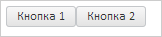

# Пример создания компонента Panel

Пример создания компонента Panel
-

# Пример создания компонента Panel

Для выполнения примера необходимо наличие на html-странице
 ссылок на файл сценария PP.js и файл стилей PP.css, в теге <body>
 html-страницы элемента 
 с идентификатором «panel». В событие onload тега <body>
 необходимо добавить вызов функции createPanel(). Добавим на страницу панель
 с двумя кнопками:

function createPanel() {
    // Создам панель
    panel = new PP.Ui.Panel({
        // Устанавливаем родительский элемент
        ParentNode: document.getElementById("panel"),
        // Устанавливаем наименование панели
        Name: "Panel",
        // Устанавливаем пользовательское позиционирование элементов
        IsAbsolutePositioning: false
    });
    // Создаем кнопки
    button1 = new PP.Ui.Button({
        Content: "Кнопка 1"
    });
    button2 = new PP.Ui.Button({
        Content: "Кнопка 2"
    });
    // Добавляем кнопки в панель
    panel.beginUpdate();
    panel.add(button1);
    panel.add(button2);
    panel.endUpdate();
}
В результате на страницу будет добавлена панель с двумя кнопками:

См. также:

[Panel](Panel.htm)

		Справочная
		 система на версию 10.9
		 от 18/08/2025,
		 © ООО «ФОРСАЙТ»,
