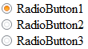

# Пример создания группы компонентов RadioButton

Пример создания группы компонентов RadioButton
-

# Пример создания группы компонентов RadioButton

Для выполнения примера добавьте ссылки на библиотеку PP.js и таблицы визуальных стилей PP.css. Разместим на странице группу компонентов [RadioButton](RadioButton.htm), состоящую из трех переключателей.

После выполнения примера на html-странице будет размещена группа компонентов [RadioButton](RadioButton.htm), состоящая из трех переключателей, первый из которых является отмеченным:

При выборе другого компонента группы отметка с предыдущего переключателя снимается.

См. также:

[RadioButton](RadioButton.htm)

		Справочная
		 система на версию 10.9
		 от 18/08/2025,
		 © ООО «ФОРСАЙТ»,
