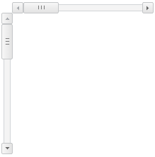

# ScrollBar

ScrollBar
-

# ScrollBar

## Описание

Компонент ScrollBar представляет
 собой полосу прокрутки. Компонент предназначен для просмотра содержимого,
 размеры которого превышают размеры контейнера.

Полоса прокрутки может быть вертикальной и горизонтальной в зависимости
 от значения свойства IsVertical.

По полосе прокрутки перемещается бегунок. Перемещение бегунка осуществляется
 за счет его перетаскивания или использования кнопок прокрутки. Размеры
 бегунка задаются при помощи метода setDraggerSize,
 позиция бегунка определяется при помощи свойства posX.

События компонента - это события, наступающие во время ([ScrollBar.MoveScroll](../../Classes/ScrollBar/ScrollBar.MoveScroll.htm))
 и после ([ScrollBar.MovedScroll](../../Classes/ScrollBar/ScrollBar.MovedScroll.htm))
 перемещения бегунка, в момент нажатия кнопки мыши ([ScrollBar.ScrollButtonMouseDown](../../Classes/ScrollBar/ScrollBar.ScrollButtonMouseDown.htm))
 и после отжатия кнопки мыши ([ScrollBar.ScrollButtonMouseUp](../../Classes/ScrollBar/ScrollBar.ScrollButtonMouseUp.htm))
 при использовании кнопок прокрутки.

## Комментарии

Компонент реализован классом [ScrollBar](../../Classes/ScrollBar/ScrollBar.htm).

## Пример

Горизонтальная и вертикальная полосы прокрутки выглядят следующим образом:

[Пример создания компонента ScrollBar](Example_ScrollBar.htm)

## Конструктор

		 Имя конструктора
		 Краткое описание

		 
		 [ScrollBar](dhtmlUi.chm::/classes/scrollbar/constructor_scrollbar.htm)
		 Конструктор ScrollBar
		 создает экземпляр компонента ScrollBar.

## Свойства

		 Имя свойства
		 Краткое описание

		 
		 [EnableMouseWheel](dhtmlUi.chm::/Classes/ScrollBar/ScrolBar.EnableMouseWheel.htm)

		 Свойство EnableMouseWheel
		 определяет возможность прокручивать ползунок колесиком мыши.

		 
		 [DraggerMinSize](dhtmlUi.chm::/Classes/ScrollBar/ScrollBar.DraggerMinSize.htm)

		 Свойство DraggerMinSize
		 определяет минимальную ширину ползунка.

		 
		 [DraggerSize](dhtmlUi.chm::/Classes/ScrollBar/ScrollBar.DraggerSize.htm)

		 Свойство DraggerSize
		 определяет ширину ползунка.

		 
		 [ScrollButtonsEnabled](dhtmlUi.chm::/Classes/ScrollBar/ScrollBar.ScrollButtonsEnabled.htm)

		 Свойство ScrollButtonsEnabled
		 определяет признак видимости кнопок прокрутки.

		 
		 [ScrollSpeed](dhtmlUi.chm::/Classes/ScrollBar/ScrollBar.ScrollSpeed.htm)

		 Свойство ScrollSpeed
		 определяет скорость прокрутки кнопками.

		 
		 [WheelScrollSpeed](dhtmlUi.chm::/Classes/ScrollBar/ScrollBar.WheelScrollSpeed.htm)

		 Свойство WheelScrollSpeed
		 определяет скорость прокрутки колесиком мыши.

## Методы

		 Имя метода
		 Краткое описание

		 
		 [getIsMoved](dhtmlUi.chm::/Classes/ScrollBar/ScrollBar.getIsMoved.htm)
		 Метод getIsMoved определяет
		 признак передвижения ползунка по полосе прокрутки.

		 
		 [getIsVertical](dhtmlUi.chm::/Classes/ScrollBar/ScrollBar.getIsVertical.htm)
		 Метод getIsVertical
		 определяет, является ли полоса прокрутки вертикальной.

		 
		 [getTrackSize](dhtmlUi.chm::/classes/scrollbar/scrollbar.gettracksize.htm)
		 Метод getTrackSize
		 возвращает размер области прокрутки.

		 
		 [scrollBy](dhtmlUi.chm::/Classes/ScrollBar/ScrollBar.scrollBy.htm)
		 Метод scrollBy перемещает
		 ползунок на определенное расстояние от его текущей позиции.

		 
		 [scrollTo](dhtmlUi.chm::/classes/scrollbar/scrollbar.scrollto.htm)
		 Метод scrollTo передвигает
		 ползунок в установленную позицию.

		 
		 [setValue](dhtmlUi.chm::/Classes/ScrollBar/ScrollBar.setValue.htm)
		 Метод setValue устанавливает
		 позицию ползунка.

## События

		  Имя события
		 Краткое описание

		 
		 [MovedScroll](dhtmlUi.chm::/classes/scrollbar/scrollbar.movedscroll.htm)
		 Событие MovedScroll
		 наступает после перемещения ползунка по полосе прокрутки.

		 
		 [MoveScroll](dhtmlUi.chm::/classes/scrollbar/scrollbar.movescroll.htm)
		 Событие MoveScroll
		 наступает при перемещении ползунка по полосе прокрутки.

		 
		 [ScrollButtonMouseDown](dhtmlUi.chm::/Classes/ScrollBar/ScrollBar.ScrollButtonMouseDown.htm)
		 Событие ScrollButtonMouseDown
		 наступает во время нажатия кнопки мыши, при нажатии кнопки перемещения
		 ползунка по полосе прокрутки.

		 
		 [ScrollButtonMouseUp](dhtmlUi.chm::/Classes/ScrollBar/ScrollBar.ScrollButtonMouseUp.htm)
		 Событие ScrollButtonMouseUp
		 наступает при отжатии кнопки мыши, после нажатия кнопки перемещения
		 ползунка по полосе прокрутки.

		 
		 [StartScroll](dhtmlUi.chm::/Classes/ScrollBar/ScrollBar.StartScroll.htm)
		 Событие StartScroll
		 наступает при начале перемещения ползунка.

## Свойства, унаследованные от класса [Control](../../Classes/Control/Control.htm)

		 Имя свойства
		 Краткое описание

		 
		 [Anchors](dhtmlUi.chm::/Classes/Control/Control.Anchors.htm)
		 Свойство Anchors определяет
		 позицию компонента, размещенного внутри контейнера.

		 
		 [Animation](dhtmlUi.chm::/Classes/Control/Control.Animation.htm)
		 Свойство Animation
		 определяет параметры анимации для компонента.

		 
		 [Bottom](dhtmlUi.chm::/Classes/Control/Control.Bottom.htm)
		 Свойство Bottom определяет
		 отступ снизу при размещении компонента внутри LayoutPanel.

		 
		 [Content](dhtmlUi.chm::/classes\control\control.content.htm)
		 Свойство Content определяет
		 содержимое компонента.

		 
		 [ContextMenu](dhtmlUi.chm::/Classes\Control\Control.ContextMenu.htm)
		 Свойство ContextMenu
		 определяет контекстное меню для компонента.

		 
		 [Data](dhtmlUi.chm::/Classes/Control/Control.Data.htm)
		 Свойство Data предназначено
		 для хранения любых пользовательских данных.

		 
		 [Enabled](dhtmlUi.chm::/classes\control\control.enabled.htm)
		 Свойство Enabled определяет
		 признак доступности компонента для использования.

		 
		 [Height](dhtmlUi.chm::/classes\control\control.height.htm)
		 Свойство Height определяет
		 высоту компонента.

		 
		 [IsRTL](dhtmlUi.chm::/classes\control\control.isrtl.htm)
		 Свойство IsRTL определяет
		 признак расположения элементов компонента по правому краю.

		 
		 [IsVisible](dhtmlUi.chm::/Classes/Control/Control.IsVisible.htm)
		 Свойство IsVisible
		 определяет признак отображения компонента.

		 
		 [Left](dhtmlUi.chm::/Classes/Control/Control.Left.htm)
		 Свойство Left определяет
		 отступ слева при размещении компонента внутри [GridPanel](dhtmlUi.chm::/Components/GridPanel/GridPanel.htm).

		 
		 [Opacity](dhtmlUi.chm::/Classes/Control/Control.Opacity.htm)
		 Свойство Opacity определяет
		 прозрачность компонента.

		 
		 [Parent](dhtmlUi.chm::/Classes/Control/Control.Parent.htm)
		 Свойство Parent определяет
		 родительский компонент элемента управления.

		 
		 [ParentNode](dhtmlUi.chm::/Classes/Control/Control.ParentNode.htm)
		 Свойство ParentNode
		 определяет родительскую DOM-вершину.

		 
		 [ResourceKey](dhtmlUi.chm::/classes\control\control.resourcekey.htm)
		 Свойство ResourceKey
		 определяет ресурсный ключ для компонента.

		 
		 [Right](dhtmlUi.chm::/Classes/Control/Control.Right.htm)
		 Свойство Right определяет
		 отступ справа при размещении компонента внутри LayoutPanel.

		 
		 [Rotate](dhtmlUi.chm::/Classes/Control/Control.Rotate.htm)
		 Свойство Rotate определяет
		 угол поворота компонента.

		 
		 [ShowToolTip](dhtmlUi.chm::/Classes/Control/Control.ShowToolTip.htm)
		 Свойство ShowToolTip
		 определяет признак возможности отображения [всплывающей
		 подсказки](dhtmlUi.chm::/Classes/Control/Control.ToolTip.htm) компонента.

		 
		 [Style](dhtmlUi.chm::/Classes/Control/Control.Style.htm)
		 Свойство Style определяет
		 стиль для компонента.

		 
		 [TabIndex](dhtmlUi.chm::/classes\control\control.tabindex.htm)
		 Свойство TabIndex определяет
		 последовательность перехода элемента управления внутри контейнера.

		 
		 [Tag](dhtmlUi.chm::/Classes/Control/Control.Tag.htm)
		 Свойство Tag определяет
		 JSON-объект, ассоциированный с компонентом.

		 
		 [ToolTip](dhtmlUi.chm::/classes\control\control.tooltip.htm)
		 Свойство ToolTip определяет
		 текст всплывающей подсказки компонента.

		 
		 [Top](dhtmlUi.chm::/Classes/Control/Control.Top.htm)
		 Свойство Top определяет
		 отступ сверху при размещении компонента внутри [GridPanel](dhtmlUi.chm::/Components/GridPanel/GridPanel.htm).

		 
		 [Value](dhtmlUi.chm::/classes\control\control.value.htm)
		 Свойство Value определяет
		 значение компонента.

		 
		 [Width](dhtmlUi.chm::/classes\control\control.width.htm)
		 Свойство Width определяет
		 ширину компонента.

## Методы, унаследованные от класса [Control](../../Classes/Control/Control.htm)

		 Имя метода
		 Краткое описание

		 
		 [addClass](dhtmlUi.chm::/classes\control\control.addclass.htm)

		 Метод addClass добавляет
		 CSS-класс к компоненту.

		 
		 [addEventHandler](dhtmlUi.chm::/Classes/Control/Control.addEventHandler.htm)
		 Метод addEventHandler
		 добавляет обработчик события на DOM-вершину.

		 
		 [addStateClass](dhtmlUi.chm::/Classes/Control/Control.addStateClass.htm)

		 Метод addStateClass
		 добавляет CSS-класс к компоненту и удаляет прежний CSS-класс.

		 
		 [addToNode](dhtmlUi.chm::/classes\control\control.addtonode.htm)

		 Метод addToNode добавляет
		 компонент в указанную вершину.

		 
		 [bindEvents](dhtmlUi.chm::/Classes/Control/Control.bindEvents.htm)
		 Метод bindEvents подписывает
		 элемент на все стандартные события.

		 
		 [getAnchorFlags](dhtmlUi.chm::/Classes/Control/Control.getAnchorFlags.htm)

		 Метод getAnchorFlags
		 возвращает JSON-объект с настройками текущей позиции компонента.

		 
		 [getClass](dhtmlUi.chm::/classes\control\control.getclass.htm)

		 Метод getClass возвращает
		 текущие css-классы компонента.

		 
		 [getCssStyle](dhtmlUi.chm::/Classes/Control/Control.getCssStyle.htm)

		 Метод getCssStyle возвращает
		 стили для указанной вершины.

		 
		 [getDomNode](dhtmlUi.chm::/Classes/Control/Control.getDomNode.htm)

		 Метод getDomNode возвращает
		 главную DOM-вершину компонента.

		 
		 [getFocused](dhtmlUi.chm::/Classes/Control/Control.getFocused.htm)

		 Метод getFocused определяет
		 наличие фокуса у компонента.

		 
		 [getIsBinded](dhtmlUi.chm::/Classes/Control/Control.getIsBinded.htm)
		 Метод getIsBinded возвращает
		 признак подписи элемента на события DOM-вершины.

		 
		 [hide](dhtmlUi.chm::/classes\control\control.hide.htm)

		 Метод hide скрывает
		 элемент управления.

		 
		 [hideToolTip](dhtmlUi.chm::/Classes/Control/Control.hideToolTip.htm)

		 Метод hideToolTip очищает
		 таймаут появления подсказки и скрывает её, если она был показана.

		 
		 [refreshStyle](dhtmlUi.chm::/Classes/Control/Control.refreshStyle.htm)
		 Метод refreshStyle
		 обновляет CSS-стили элемента.

		 
		 [removeClass](dhtmlUi.chm::/classes\control\control.removeclass.htm)

		 Метод removeClass удаляет
		 CSS-класс из компонента.

		 
		 [removeEventHandler](dhtmlUi.chm::/Classes/Control/Control.removeEventHandler.htm)
		 Метод removeEventHandler
		 удаляет обработчик события DOM-вершины.

		 
		 [removeFromDOM](dhtmlUi.chm::/classes/control/control.removefromdom.htm)
		 Метод removeFromDOM
		 удаляет вершину из DOM-структуры.

		 
		 [removeStateClasses](dhtmlUi.chm::/Classes/Control/Control.removeStateClasses.htm)

		 Метод removeStateClasses
		 удаляет CSS-классы компонента.

		 
		 [setDraggable](dhtmlUi.chm::/classes\control\control.setdraggable.htm)

		 Метод setDraggable
		 устанавливает возможность перетаскивания компонента на HTML-странице.

		 
		 [setFocus](dhtmlUi.chm::/Classes/Control/Control.setFocus.htm)

		 Метод setFocus устанавливает
		 фокус компонента.

		 
		 [setIsHovered](dhtmlUi.chm::/Classes/Control/Control.setIsHovered.htm)

		 Метод setIsHovered
		 настраивает отображение компонента только при наведении на него
		 курсора.

		 
		 [setSize](dhtmlUi.chm::/classes\control\control.setsize.htm)

		 Метод setSize устанавливает
		 размеры компонента.

		 
		 [show](dhtmlUi.chm::/classes/control/control.show.htm)

		 Метод show отображает
		 элемент управления.

		 
		 [unBindEvents](dhtmlUi.chm::/Classes/Control/Control.unBindEvents.htm)
		 Метод unBindEvents
		 отписывает элемент от всех стандартных событий.

		 
		 [updatePosition](dhtmlUi.chm::/Classes/Control/Control.updatePosition.htm)

		 Метод updatePosition
		 корректирует размер и положение при абсолютном позиционировании
		 на основе текущих параметров.

		 
		 [updateSize](dhtmlUi.chm::/classes\control\control.updatesize.htm)

		 Метод updateSize обновляет
		 размеры компонента подгонке размеров контейнера, в котором находится
		 компонент.

## События, унаследованные от класса [Control](../../Classes/Control/Control.htm)

		 Имя события
		 Краткое описание

		 
		 [Drag](dhtmlUi.chm::/classes\control\control.drag.htm)
		 Событие Drag наступает
		 при нажатии и удерживании кнопки мыши.

		 
		 [DragEnd](dhtmlUi.chm::/classes\control\control.dragend.htm)
		 Событие DragEnd наступает
		 при окончании перетаскивания компонента.

		 
		 [DragStart](dhtmlUi.chm::/classes\control\control.dragstart.htm)
		 Событие DragStart наступает,
		 когда начинается перетаскивание компонента.

		 
		 [OnContextMenu](dhtmlUi.chm::/classes\control\control.OnContextMenu.htm)
		 Событие OnContextMenu
		 наступает при вызове контекстного меню компонента.

		 
		 [SizeChanged](dhtmlUi.chm::/Classes/Control/Control.SizeChanged.htm)
		 Событие SizeChanged
		 наступает после изменения размеров компонента.

		 
		 [SizeChanging](dhtmlUi.chm::/Classes/Control/Control.SizeChanging.htm)
		 Событие SizeChanging
		 наступает во время изменения размеров компонента.

## Свойства, унаследованные от класса [Object](dhtmlCommon.chm::/Classes/object/object.htm)

		 Имя свойства
		 Краткое описание

		 
		 [Id](dhtmlCommon.chm::/classes\object\object.id.htm)

		 Свойство Id определяет
		 идентификатор объекта репозитория.

## Методы, унаследованные от класса [Object](dhtmlCommon.chm::/Classes/object/object.htm)

		 Имя метода
		 Краткое описание

		 
		 [clone](dhtmlCommon.chm::/classes\object\object.clone.htm)
		 Метод clone создает
		 копию объекта.

		 
		 [dispose](dhtmlCommon.chm::/classes\object\object.dispose.htm)
		 Метод dispose уничтожает
		 компонент.

		 
		 [getHashCode](dhtmlCommon.chm::/Classes/Object/Object.getHashCode.htm)
		 Метод getHashCode возвращает
		 хеш-код объекта репозитория.

		 
		 [getId](dhtmlCommon.chm::/Classes/Object/Object.Id.htm)
		 Метод getId возвращает
		 идентификатор объекта репозитория.

		 
		 [getSettings](dhtmlCommon.chm::/Classes/Object/Object.getSettings.htm)
		 Метод getSettings возвращает
		 настройки объекта репозитория.

		 
		 [getTypeName](dhtmlCommon.chm::/classes\object\object.gettypename.htm)
		 Метод getTypeName возвращает
		 имя типа объекта без пространства имен, к которому он принадлежит.

		 
		 [isEqual](dhtmlCommon.chm::/Classes/Object/Object.isEqual.htm)
		 Метод isEqual определяет,
		 равен ли заданный объект текущему объекту репозитория.

		 
		 [isLive](dhtmlCommon.chm::/Classes/Object/Object.isLive.htm)
		 Метод isLive определяет
		 действительность объекта репозитория.

		 
		 [removeAllEvents](dhtmlCommon.chm::/Classes/Object/Object.removeAllEvents.htm)
		 Метод removeAllEvents
		 удаляет все обработчики событий объекта по заданному контексту.

		 
		 [setId](dhtmlCommon.chm::/Classes/Object/Object.Id.htm)
		 Метод setId определяет
		 идентификатор объекта репозитория.

		 
		 [setSettings](dhtmlCommon.chm::/Classes/Object/Object.setSettings.htm)
		 Метод setSettings задает
		 настройки объекта репозитория.

		 
		 [defineProps](dhtmlCommon.chm::/Classes/Object/Object.defineProps.htm)
		 Метод defineProps создает
		 методы get и set из массива имен для указанного класса.

		 
		 [keys](dhtmlCommon.chm::/Classes/Object/Object.keys.htm)
		 Метод keys возвращает
		 массив названий методов и свойств для указанного объекта.

См. также:

[DHTML-компоненты](dhtml.chm::/DHTML_components.htm)

		Справочная
		 система на версию 10.9
		 от 18/08/2025,
		 © ООО «ФОРСАЙТ»,
