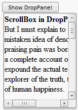

# Созданиe раскрывающейся панели с полосами прокрутки

Созданиe раскрывающейся панели с полосами прокрутки
-

# Созданиe раскрывающейся панели с полосами прокрутки

Для выполнения примера в теге HEAD должны быть добавлены ссылки на библиотеку PP.js и таблицы визуальных стилей PP.css. Чтобы на панели появились полосы прокрутки, размеры содержимого должны превышать размеры панели. Создадим компонент [DropPanel](../DropPanel/DropPanel.htm) с полосами прокрутки:

<body>

<!--Размещаем кнопку, которая раскрывает панель-->

    

</body>

После выполнения примера на html-странице появится кнопка «Show DropPanel». При нажатии на кнопку раскроется панель с расположенными справа и снизу полосами прокрутки:

Чтобы полосы прокрутки были слева и сверху, для свойства [IsRTL](../../Classes/Control/Control.IsRTL.htm) установите значение true

См. также:

[ScrollBox](ScrollBox.htm)

		Справочная
		 система на версию 10.9
		 от 18/08/2025,
		 © ООО «ФОРСАЙТ»,
