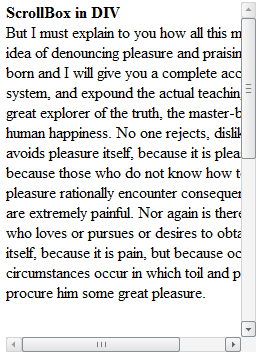

# Добавление полос прокрутки к содержимому тега div

Добавление полос прокрутки к содержимому тега div
-

# Добавление полос прокрутки к содержимому тега div

Для выполнения примера в теге HEAD должны быть добавлены ссылки на библиотеку
 PP.js и таблицы визуальных стилей PP.css. Добавим на html-страницу область
 с полосами прокрутки:

<body>

<!--Размещаем компонент
 ScrollBox и указываем его параметры-->

<!--Размещаем внутри
 компонента ScrollBox область с текстом, указываем ее размеры-->

        

            <b>ScrollBox
 in DIV</b> 

            But
 I must explain to you how all this mistaken idea of denouncing pleasure
 and

            praising
 pain was born and I will give you a complete account of the system, and

            expound
 the actual teachings of the great explorer of the truth, the master-builder

            of
 human happiness. No one rejects, dislikes, or avoids pleasure itself,
 because

            it
 is pleasure, but because those who do not know how to pursue pleasure
 rationally

            encounter
 consequences that are extremely painful. Nor again is there anyone who

            loves
 or pursues or desires to obtain pain of itself, because it is pain, but
 because

            occasionally
 circumstances occur in which toil and pain can procure him some great

            pleasure.

        

    

</body>

После выполнения примера на html-странице будет размещена текстовая
 область с полосами прокрутки:

См. также:

[ScrollBox](ScrollBox.htm)

		Справочная
		 система на версию 10.9
		 от 18/08/2025,
		 © ООО «ФОРСАЙТ»,
