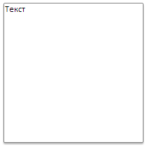

# Пример создания компонента ShadowDropPanel

Пример создания компонента ShadowDropPanel
-

# Пример создания компонента ShadowDropPanel

Для выполнения примера необходимо наличие на html-странице ссылок на
 файлы сценариев PP.js, PP.Ext.js и файл стилей PP.css, в теге <body>
 html-документа элемента 
 с идентификатором «panel». В событие
 onload тега <body> необходимо добавить вызов функции createShadowDropPanel().
 Создаем и отображаем всплывающую панель с тенью:

function createShadowDropPanel() {
    // Создам панель с тенью
    shadowDropPanel = new PP.Ui.DropPanel({
        // Устанавливаем родительский элемент
        ParentNode: document.getElementById("panel"),
        // Устанавливаем ширину панели
        Width: 200,
        // Устанавливаем высоту панели
        Height: 200,
        // Устанавливаем максимальную высоту панели
        MaxDropDownHeight: 500,
        // Устанавливаем максимальную ширину панели
        MaxDropDownWidth: 500,
        // Устанавливаем минимальную высоту панели
        MinDropDownHeight: 100,
        // Устанавливаем минимальную ширину панели
        MinDropDownWidth: 100,
        // Устанавливаем содержимое панели
        Content: "Текст"
    });
    // Отображаем панель
    shadowDropPanel.show(10, 10);
}
В результате будет отображена всплывающая панель с тенью:

См. также:

[ShadowDropPanel](ShadowDropPanel.htm)

		Справочная
		 система на версию 10.9
		 от 18/08/2025,
		 © ООО «ФОРСАЙТ»,
