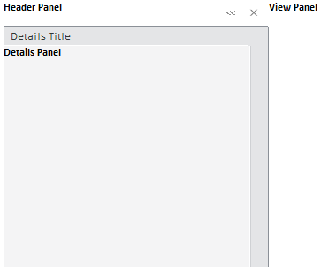
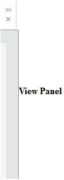

# Пример создания компонента SlidePanel

Пример создания компонента SlidePanel
-

# Пример создания компонента SlidePanel

Для выполнения примера в теге HEAD должны быть добавлены ссылки на файлы PP.js, PP.css и PP.Metabase.css. Далее приведен javascript-код, при помощи которого создается компонент [SlidePanel](SlidePanel.htm).

    var slidePanel = new PP.Ui.SlidePanel({
        ParentNode: document.getElementById("slide"),
        //Заголовок панели Details
        DetailsTitleContent: "Details Title",
        //Всплывающая подсказка для кнопки закрытия консоли
        CloseToolTip: "Close",
        //Всплывающая подсказка для кнопки сворачивания консоли
        CollapseConsoleToolTip: "CollapseConsole",
        //Всплывающая подсказка для кнопки разворачивания консоли
         ExpandConsoleToolTip: "ExpandConsole",
        //Всплывающая подсказка для панели Header
        HeaderToolTip: "Header",
        //Содержимое панели Header
        HeaderContent: "
<b>Header Panel</b>",
        //Содержимое панели View
        ViewContent: "
<b>View Panel</b>
",
        //Содержимое панели Details
        DetailsContent: "
<b>Details Panel</b>
",
        //ширина левой панели
        LeftPanelWidth: 300
    });
    //высота компонента
    slidePanel.setHeight(300)
    slidePanel.setWidth(500)

После выполнения примера на будет создан компонент [SlidePanel](SlidePanel.htm), имеющий следующий вид:

При нажатии на кнопку  будет свернута консоль:

См. также:

[SlidePanel](SlidePanel.htm)

		Справочная
		 система на версию 10.9
		 от 18/08/2025,
		 © ООО «ФОРСАЙТ»,
