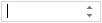

# Пример создания компонента SpinEdit

Пример создания компонента SpinEdit
-

# Пример создания компонента SpinEdit

Для выполнения примера подключите библиотеку компонентов PP.js и таблицы
 визуальных стилей PP.css. Далее приведен javascript-код, при помощи которого
 на html-странце будет размещено поле ввода с кнопками прокрутки:

После выполнения примера на html-странице будет размещено поле ввода
 с кнопками прокрутки:

В поле ввода установлен курсор - это результат использования метода
 [SpinEdit.setFocus](dhtmlCommon.chm::/Classes/SpinEdit/SpinEdit.setFocus.htm).

Введите в поле ввода число. При нажатии кнопок прокрутки или клавиш
 UP/DOWN значение в поле ввода будет уменьшаться/увеличиваться на
 10 (результат выполнения функций spinDown и spinUp).

Если ввести в редактор текстовое значение или числовое значение больше
 или меньше 1000, то загорится индикатор некорректного ввода (результат
 выполнения функции OnAfterChange).

В созданном компоненте не допускается ввод значения 100 (результат выполнения
 функции OnBeforeChange).

См. также:

[SpinEdit](SpinEdit.htm)

		Справочная
		 система на версию 10.9
		 от 18/08/2025,
		 © ООО «ФОРСАЙТ»,
