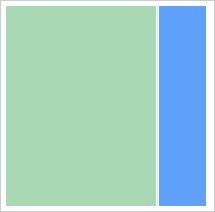
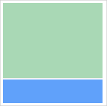

# Пример создания компонента Splitter

Пример создания компонента Splitter
-

# Пример создания компонента Splitter

Для выполнения примера подключите библиотеку компонентов PP.js и таблицы
 визуальных стилей PP.css. Далее приведен код, при помощи которого на html-странице
 будет размещен компонент [Splitter](Splitter.htm), регулирующий
 размеры двух панелей:

<body onload="createSplitter()">
    

    
</body>

После выполнения примера на html-странице будет размещен компонент [Splitter](Splitter.htm), имеющий следующий вид:

В консоль будет выведено сообщение об изменении значения разделителя:

Изменилось значение разделителя

Изменяем ориентацию компонента на вертикальную и получаем размер области,
 с помощью которой изменяется размер панелей:

// Устанваливаем вертикальную ориентацию у компонента
splitter.setIsVertical(true);
// Получаем размер области, с помощью которой происходит изменение размера панелей
console.log("Размер области, с помощью которой изменяется размер панелей: " + splitter.getResizerSize());
В результате компонент [Splitter](Splitter.htm) будет
 отображен вертикально:

В консоль будет выведен размер области, с помощью которой изменяется
 размер панелей:

Размер области, с помощью которой изменяется размер
 панелей: 3

См. также:

[Splitter](Splitter.htm)

		Справочная
		 система на версию 10.9
		 от 18/08/2025,
		 © ООО «ФОРСАЙТ»,
