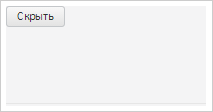
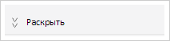

# Пример создания компонента Spoiler

Пример создания компонента Spoiler
-

# Пример создания компонента Spoiler

Для выполнения примера необходимо наличие на html-странице
 ссылок на файл сценария PP.js и файл стилей PP.css, в теге <body>
 html-страницы элемента 
 с идентификатором «spoiler». В событие onload тега <body>
 необходимо добавить вызов функции createSpoiler(). Добавим на страницу
 раскрывающуюся панель и поместим на нее кнопку:

function createSpoiler() {
    // Создаем панель
    spoiler = new PP.Ui.Spoiler({
        // Устанавливаем родительский элемент
        ParentNode: document.getElementById("spoiler"),
        // Устанавливаем направление раскрытия панели
        Position: PP.Ui.SpoilerPosition.Top,
        // Устанавливаем минимальный размер панели
        MinPanelSize: 50,
        // Устанавливаем максимальный размер панели
        MaxPanelSize: 250,
        // Устанавливаем размеры панели
        Height: 100,
        Width: 200,
        // Устанавливаем размеры объекта предназначенного для изменения размера панели
        DefaultResizerSize: 5,
        // Устанавливаем отступ содержимого от края панели
        DefaultContentMargin: 0,
        // Устанавливаем заголовок
        Title: "Раскрыть",
        // Разрешаем изменение размера панели
        EnableResize: true,
        // Разрешаем сворачивание панели
        EnableCollapse: true,
        // Добавляем обработчик события сворачивания панели
        Collapsed: function (sender, args) {
            console.log("Панель свернута");
        },
        // Добавляем обработчик разворачивания панели
        Expanded: function (sender, args) {
        console.log("Панель развернута");
    }
    });
    // Добавляем кнопку
    spoiler.setContent(new PP.Ui.Button({
        Content: "Скрыть",
        Click: function (sender, args) {
            // Сворачиваем панель по нажатию кнопки
            spoiler.setIsExpanded(false);
        }
    }));
}
В результате на страницу будет добавлена раскрывающаяся панель с кнопкой:

После нажатия на кнопку панель будет свернута:

В консоль будет выведено сообщение о сворачивании панели:

Панель свернута

После нажатия на кнопку с содержимым «>>» панель будет развернута.
 В консоль будет выведено сообщение о разворачивании панели:

Панель развернута

См. также:

[Spoiler](Spoiler.htm)

		Справочная
		 система на версию 10.9
		 от 18/08/2025,
		 © ООО «ФОРСАЙТ»,
