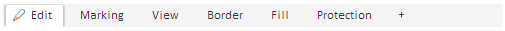

# Пример создания компонента TabControl

Пример создания компонента TabControl
-

# Пример создания компонента TabControl

Для выполнения примера подключите библиотеку компонентов PP.js и таблицы визуальных стилей PP.css. Далее приведен javascript-код, при помощи которого создается компонент [TabControl](TabControl.htm).

     //создаем компонент TabControl
    var tabcontrol= new PP.Ui.TabControl({
       Id: "TabControl1",
       ParentNode: document.getElementById("sample"),
      //запрещаем перетаскивать вкладки
       DragDropEnabled: false,
       //путь к папке с картинками
       ImagePath: "build/img/",
       Width: 500,
       Height: 40,
       //массив вкладок
       Items: [{
         //заголовок вкладки
          Caption: "Edit",
         //путь до картинки, которая будет отображаться в заголовке вкладки
          ImageUrl: "build/img/navigator/ribbon/edit.png",
         //позиция вкладки
          Position: PP.LTRB.Top
       }, {
          Caption: "Marking",
          Position: PP.LTRB.Top
       }, {
          Caption: "View",
          Position: PP.LTRB.Top
       }, {
          Caption: "Border",
          Position: PP.LTRB.Top
       }, {
          Caption: "Fill",
          Position: PP.LTRB.Top
       }]
    });
     //добавляем вкладку
    tabcontrol.addItem({
       Caption: "Protection",
       Position: PP.LTRB.Top
    });

После выполнения примера на html-странице будет размещен компонент [TabControl](TabControl.htm), имеющий следующий вид:

См. также:

[TabControl](TabControl.htm)

		Справочная
		 система на версию 10.9
		 от 18/08/2025,
		 © ООО «ФОРСАЙТ»,
