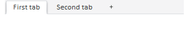
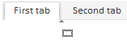

# TabControl

TabControl
-

# TabControl

# Описание

Компонент TabControl представляет собой элемент управления, содержащий несколько элементов, использующих одно рабочее пространство.

## Комментарии

Компонент реализован классом [TabControl](../../Classes/TabControl/TabControl.htm).

Дочерним элементом компонента TabControl является компонент TabItem, представляющий из себя вкладку.

## Пример

Компонент может включать в себя несколько вкладок. Новые вкладки добавляются при нажатии на вкладку со знаком «+». Во время добавления новых вкладок наступают события [AfterAddItem](../../Classes/TabControl/TabControl.AfterAddItem.htm) и [BeforeAddItem](../../Classes/TabControl/TabControl.BeforeAddItem.htm).

Вкладка открывается при нажатии на заголовок. С открытием и закрытием вкладок связаны события [ItemSelected](../../Classes/TabControl/TabControl.ItemSelected.htm) и [ItemDeselected](../../Classes/TabControl/TabControl.ItemDeselected.htm).

При помощи свойства [TabControl.EnableDelete](../../Classes/TabControl/TabControl.EnableDelete.htm) можно отобразить на вкладках значок , при нажатии на который будет удалена вкладка.

При помощи свойства [TabControl.EnableEdit](../../Classes/TabControl/TabControl.EnableEdit.htm) можно сделать редактируемыми заголовки вкладок.

В зависимости от значения свойства [DragDropEnabled](../../Classes/TabControl/TabControl.DragDropEnabled.htm) вкладки могут перетаскиваться при помощи механизма Drag&Drop:

[ItemMoved](../../Classes/TabControl/TabControl.ItemMoved.htm) - событие перемещения вкладки.

[Пример создания компонента TabControl](Example_TabControl.htm)

## Конструктор

		 Имя конструктора
		 Краткое описание

		 
		 [TabControl](dhtmlUi.chm::/classes/tabcontrol/conctructor_tabcontrol.htm)
		 Конструктор TabControl
		 создает экземпляр компонента TabControl.

## Свойства

		 Имя свойства
		 Краткое описание

		 
		 [AddTabButtonTemplate](dhtmlUi.chm::/Classes/TabControl/TabControl.AddTabButtonTemplate.htm)
		 Свойство AddTabButtonTemplate
		 определяет шаблон вкладки при добавлении её в панель.

		 
		 [Background](dhtmlUi.chm::/classes/tabcontrol/tabcontrol.background.htm)
		 Свойство Background
		 определяет фон для панели компонента. на которой размещаются заголовки
		 вкладок.

		 
		 [Buttons](dhtmlUi.chm::/Classes/TabControl/TabControl.Buttons.htm)
		 Свойство Buttons определяет
		 объект с массивами кнопок каждой стороны элемента управления.

		 
		 [ContentAutoFit](dhtmlUi.chm::/Classes/TabControl/TabControl.ContentAutoFit.htm)
		 Свойство ContentAutoFit
		 определяет признак автоматической подгонки содержимого элемента
		 управления под родительский элемент.

		 
		 [DragDropEnabled](dhtmlUi.chm::/classes/tabcontrol/tabcontrol.dragdropenabled.htm)
		 Свойство DragDropEnabled
		 определяет признак возможности изменения положения вкладок при
		 помощи механизма Drag&Drop.

		 
		 [EnableDelete](dhtmlUi.chm::/classes/tabcontrol/tabcontrol.enabledelete.htm)
		 Свойство EnableDelete
		 определяет признак доступности удаления вкладок.

		 
		 [EnableDragOutside](dhtmlUi.chm::/Classes/TabControl/TabControl.EnableDragOutside.htm)
		 Свойство EnableDragOutside
		 определяет признак возможности выноса вкладки из элемента управления.

		 
		 [EnableDropFromOutside](dhtmlUi.chm::/Classes/TabControl/TabControl.EnableDropFromOutside.htm)
		 Свойство EnableDropFromOutside
		 определяет признаки возможности вставки вкладки из другого элемента
		 управления.

		 
		 [EnableEdit](dhtmlUi.chm::/classes/tabcontrol/tabcontrol.enableedit.htm)
		 Свойство EnableEdit
		 определяет признак возможности редактирования заголовков вкладок.

		 
		 [EnableGroupSeparator](dhtmlUi.chm::/Classes/TabControl/TabControl.EnableGroupSeparator.htm)
		 Свойство EnableGroupSeparator
		 определяет признак наличия разделителя между группами вкладок.

		 
		 [HeaderHeight](dhtmlUi.chm::/Classes/TabControl/TabControl.HeaderHeight.htm)
		 Свойство HeaderHeight
		 определяет высоту вкладок элемента управления.

		 
		 [ImagePath](dhtmlUi.chm::/classes/tabcontrol/tabcontrol.imagepath.htm)
		 Свойство ImagePath
		 указывает путь до папки с изображениями для компонента.

		 
		 [IsAddTabButtonVisible](dhtmlUi.chm::/Classes/TabControl/TabControl.IsAddTabButtonVisible.htm)
		 Свойство IsAddTabButtonVisible
		 определяет признак отображения вкладки для добавления новых вкладок.

		 
		 [Items](dhtmlUi.chm::/Classes/TabControl/TabControl.Items.htm)
		 Свойство Items содержит
		 массив вкладок элемента управления.

		 
		 [MenuAddItems](dhtmlUi.chm::/Classes/TabControl/TabControl.MenuAddItems.htm)
		 Свойство MenuAddItems
		 определяет меню добавления вкладок.

		 
		 [PaddingLeft](dhtmlUi.chm::/Classes/TabControl/TabControl.PaddingLeft.htm)
		 Свойство PaddingLeft
		 определяет величину левого отступа панели вкладок элемента управления.

		 
		 [SelectedIndex](dhtmlUi.chm::/classes/tabcontrol/tabcontrol.selectedindex.htm)
		 Свойство SelectedIndex
		 определяет выделенную вкладку по индексу.

		 
		 [SelectedItem](dhtmlUi.chm::/classes/tabcontrol/tabcontrol.selecteditem.htm)
		 Свойство SelectedItem
		 определяет выделенную вкладку.

		 
		 [SelectOnStartEditing](dhtmlUi.chm::/Classes/TabControl/TabControl.SelectOnStartEditing.htm)
		 Свойство SelectOnStartEditing
		 определяет признак выделения заголовка вкладки при двойном щелчке
		 по нему.

		 
		 [UseToolBarSwitch](dhtmlUi.chm::/Classes/TabControl/TabControl.UseToolBarSwitch.htm)
		 Свойство UseToolBarSwitch
		 определяет признак стиля вкладок, как у панели инструментов.

## Методы

		 Имя метода
		 Краткое описание

		 
		 [addButton](dhtmlUi.chm::/Classes/TabControl/TabControl.addButton_M.htm)
		 Метод addButton добавляет
		 кнопку в компонент TabControl.

		 
		 [addItem](dhtmlUi.chm::/classes/tabcontrol/tabcontrol.additem.htm)
		 Метод addItem добавляет
		 вкладку к компоненту.

		 
		 [beginUpdate](dhtmlUi.chm::/Classes/TabControl/TabControl.beginUpdate.htm)
		 Метод beginUpdate отключает
		 перерисовку элемента управления.

		 
		 [clear](dhtmlUi.chm::/classes/tabcontrol/tabcontrol.clear.htm)
		 Метод clear удаляет
		 все вкладки компонента.

		 
		 [endUpdate](dhtmlUi.chm::/Classes/TabControl/TabControl.endUpdate.htm)
		 Метод endUpdate включает
		 перерисовку элемента управления и обновляет её.

		 
		 [getActiveItem](dhtmlUi.chm::/Classes/TabControl/TabControl.getActiveItem.htm)
		 Метод getActiveItem
		 возвращает выделенную вкладку элемента управления.

		 
		 [getContentPanel](dhtmlUi.chm::/classes/tabcontrol/tabcontrol.getcontentpanel.htm)
		 Метод getContentPanel
		 возвращает DOM-узел, в котором располагается содержимое вкладок.

		 
		 [getItemsList](dhtmlUi.chm::/classes/tabcontrol/tabcontrol.getitemslist.htm)
		 Метод getItemsList
		 возвращает список вкладок из раскрывающейся панели компонента.

		 
		 [getToolBarButtonByTabItem](dhtmlUi.chm::/Classes/TabControl/TabControl.getToolBarButtonByTabItem.htm)
		 Метод getToolBarButtonByTabItem
		 возвращает кнопку панели инструментов вкладки элемента управления.

		 
		 [getToolBarButtonTemplate](dhtmlUi.chm::/Classes/TabControl/TabControl.getToolBarButtonTemplate.htm)
		 Метод getToolBarButtonTemplate
		 возвращает шаблон кнопок панели инструментов.

		 
		 [getVisibleItems](dhtmlUi.chm::/Classes/TabControl/TabControl.getVisibleItems.htm)
		 Метод getVisibleItems
		 возвращает массив видимых вкладок панели элемента управления.

		 
		 [hideContent](dhtmlUi.chm::/classes/tabcontrol/tabcontrol.hidecontent.htm)
		 Метод hideContent скрывает
		 содержимое вкладок.

		 
		 [insertButton](dhtmlUi.chm::/Classes/TabControl/TabControl.insertButton.htm)
		 Метод insertButton
		 добавляет кнопку в компонент TabControl.

		 
		 [insertItem](dhtmlUi.chm::/Classes/TabControl/TabControl.insertItem.htm)
		 Метод insertItem добавляет
		 вкладку в указанную позицию.

		 
		 [removeItem](dhtmlUi.chm::/classes/tabcontrol/tabcontrol.removeitem.htm)
		 Метод removeItem удаляет
		 из компонента вкладку по ее индексу.

		 
		 [removeItemByIndex](dhtmlUi.chm::/Classes/TabControl/TabControl.removeItemByIndex.htm)
		 Метод removeItemByIndex
		 удаляет вкладку по индексу.

		 
		 [scrollToItem](dhtmlUi.chm::/Classes/TabControl/TabControl.scrollToItem.htm)
		 Метод scrollToItem прокручивает
		 панель вкладок до указанной вкладки.

		 
		 [showContent](dhtmlUi.chm::/classes/tabcontrol/tabcontrol.showcontent.htm)
		 Метод showContent отображает
		 содержимое вкладок.

## События

		 Имя события
		 Краткое описание

		 
		 [AddButton](dhtmlUi.chm::/Classes/TabControl/TabControl.AddButton.htm)
		 Событие AddButton наступает
		 при добавлении кнопки в элемент управления вкладками.

		 
		 [AddMenuShowing](dhtmlUi.chm::/Classes/TabControl/TabControl.AddMenuShowing.htm)
		 Событие AddMenuShowing
		 наступает во время вызова меню добавления вкладки.

		 
		 [AfterAddItem](dhtmlUi.chm::/classes/tabcontrol/tabcontrol.afteradditem.htm)
		 Событие AfterAddItem
		 наступает после добавления в компонент новой вкладки.

		 
		 [BeforeAddItem](dhtmlUi.chm::/classes/tabcontrol/tabcontrol.beforeadditem.htm)
		 Событие BeforeAddItem
		 наступает перед добавлением [новой
		 вкладки](dhtmlUi.chm::/Classes\TabControl\TabControl.IsAddTabButtonVisible.htm).

		 
		 [BeforeShowGroupSeparator](dhtmlUi.chm::/Classes/TabControl/TabControl.BeforeShowGroupSeparator.htm)
		 Событие BeforeShowGroupSeparator
		 наступает перед отображением разделителя между группами вкладок.

		 
		 [ItemDeselected](dhtmlUi.chm::/classes/tabcontrol/tabcontrol.itemdeselected.htm)
		 Событие ItemDeselected
		 наступает при закрытии вкладки.

		 
		 [ItemMoved](dhtmlUi.chm::/classes/tabcontrol/tabcontrol.itemmoved.htm)
		 Событие ItemMoved наступает
		 после перемещения вкладки.

		 
		 [ItemSelected](dhtmlUi.chm::/classes/tabcontrol/tabcontrol.itemselected.htm)
		 Событие ItemSelected
		 наступает при выборе вкладки.

		 
		 [SelectableSelected](dhtmlUi.chm::/Classes/TabControl/TabControl.SelectableSelected.htm)
		 Событие SelectableSelected
		 наступает при нажатии кнопки мыши на элемент.

		 
		 [TabDeleted](dhtmlUi.chm::/classes/tabcontrol/tabcontrol.tabdeleted.htm)
		 Событие TabDeleted
		 наступает после удаления вкладки.

		 
		 [TabDragIn](dhtmlUi.chm::/Classes/TabControl/TabControl.TabDragIn.htm)
		 Событие TabDragIn наступает
		 при внесении вкладки в область элемента управления.

		 
		 [TabDragOut](dhtmlUi.chm::/Classes/TabControl/TabControl.TabDragOut.htm)
		 Событие TabDragOut
		 наступает при вынесении вкладки за пределы области элемента управления.

		 
		 [TabEdited](dhtmlUi.chm::/classes/tabcontrol/tabcontrol.tabedited.htm)
		 Событие TabEdited наступает
		 после выхода из режима редактирования.

		 
		 [TabEditing](dhtmlUi.chm::/classes/tabcontrol/tabcontrol.tabediting.htm)
		 Событие TabEditing
		 наступает при переходе в режим редактирования.

		 
		 [TabMenuShowing](dhtmlUi.chm::/Classes/TabControl/TabControl.TabMenuShowing.htm)
		 Событие TabMenuShowing
		 наступает во время вызова меню у вкладки.

		 
		 [TabTextEdited](dhtmlUi.chm::/classes/tabcontrol/tabcontrol.tabtextedited.htm)
		 Событие TabTextEdited
		 наступает при выходе из режима редактирования, если был изменён
		 текст заголовка.

		 
		 [TabTextEditing](dhtmlUi.chm::/Classes/TabControl/TabControl.TabTextEditing.htm)
		 Событие TabTextEditing
		 наступает при выходе из режима редактирования заголовка вкладки,
		 даже если текст данного заголовка не был изменён.

## Свойства, унаследованные от класса [Control](../../Classes/Control/Control.htm)

		 Имя свойства
		 Краткое описание

		 
		 [Anchors](dhtmlUi.chm::/Classes/Control/Control.Anchors.htm)
		 Свойство Anchors определяет
		 позицию компонента, размещенного внутри контейнера.

		 
		 [Animation](dhtmlUi.chm::/Classes/Control/Control.Animation.htm)
		 Свойство Animation
		 определяет параметры анимации для компонента.

		 
		 [Bottom](dhtmlUi.chm::/Classes/Control/Control.Bottom.htm)
		 Свойство Bottom определяет
		 отступ снизу при размещении компонента внутри LayoutPanel.

		 
		 [Content](dhtmlUi.chm::/classes\control\control.content.htm)
		 Свойство Content определяет
		 содержимое компонента.

		 
		 [ContextMenu](dhtmlUi.chm::/Classes\Control\Control.ContextMenu.htm)
		 Свойство ContextMenu
		 определяет контекстное меню для компонента.

		 
		 [Data](dhtmlUi.chm::/Classes/Control/Control.Data.htm)
		 Свойство Data предназначено
		 для хранения любых пользовательских данных.

		 
		 [Enabled](dhtmlUi.chm::/classes\control\control.enabled.htm)
		 Свойство Enabled определяет
		 признак доступности компонента для использования.

		 
		 [Height](dhtmlUi.chm::/classes\control\control.height.htm)
		 Свойство Height определяет
		 высоту компонента.

		 
		 [IsRTL](dhtmlUi.chm::/classes\control\control.isrtl.htm)
		 Свойство IsRTL определяет
		 признак расположения элементов компонента по правому краю.

		 
		 [IsVisible](dhtmlUi.chm::/Classes/Control/Control.IsVisible.htm)
		 Свойство IsVisible
		 определяет признак отображения компонента.

		 
		 [Left](dhtmlUi.chm::/Classes/Control/Control.Left.htm)
		 Свойство Left определяет
		 отступ слева при размещении компонента внутри [GridPanel](dhtmlUi.chm::/Components/GridPanel/GridPanel.htm).

		 
		 [Opacity](dhtmlUi.chm::/Classes/Control/Control.Opacity.htm)
		 Свойство Opacity определяет
		 прозрачность компонента.

		 
		 [Parent](dhtmlUi.chm::/Classes/Control/Control.Parent.htm)
		 Свойство Parent определяет
		 родительский компонент элемента управления.

		 
		 [ParentNode](dhtmlUi.chm::/Classes/Control/Control.ParentNode.htm)
		 Свойство ParentNode
		 определяет родительскую DOM-вершину.

		 
		 [ResourceKey](dhtmlUi.chm::/classes\control\control.resourcekey.htm)
		 Свойство ResourceKey
		 определяет ресурсный ключ для компонента.

		 
		 [Right](dhtmlUi.chm::/Classes/Control/Control.Right.htm)
		 Свойство Right определяет
		 отступ справа при размещении компонента внутри LayoutPanel.

		 
		 [Rotate](dhtmlUi.chm::/Classes/Control/Control.Rotate.htm)
		 Свойство Rotate определяет
		 угол поворота компонента.

		 
		 [ShowToolTip](dhtmlUi.chm::/Classes/Control/Control.ShowToolTip.htm)
		 Свойство ShowToolTip
		 определяет признак возможности отображения [всплывающей
		 подсказки](dhtmlUi.chm::/Classes/Control/Control.ToolTip.htm) компонента.

		 
		 [Style](dhtmlUi.chm::/Classes/Control/Control.Style.htm)
		 Свойство Style определяет
		 стиль для компонента.

		 
		 [TabIndex](dhtmlUi.chm::/classes\control\control.tabindex.htm)
		 Свойство TabIndex определяет
		 последовательность перехода элемента управления внутри контейнера.

		 
		 [Tag](dhtmlUi.chm::/Classes/Control/Control.Tag.htm)
		 Свойство Tag определяет
		 JSON-объект, ассоциированный с компонентом.

		 
		 [ToolTip](dhtmlUi.chm::/classes\control\control.tooltip.htm)
		 Свойство ToolTip определяет
		 текст всплывающей подсказки компонента.

		 
		 [Top](dhtmlUi.chm::/Classes/Control/Control.Top.htm)
		 Свойство Top определяет
		 отступ сверху при размещении компонента внутри [GridPanel](dhtmlUi.chm::/Components/GridPanel/GridPanel.htm).

		 
		 [Value](dhtmlUi.chm::/classes\control\control.value.htm)
		 Свойство Value определяет
		 значение компонента.

		 
		 [Width](dhtmlUi.chm::/classes\control\control.width.htm)
		 Свойство Width определяет
		 ширину компонента.

## Методы, унаследованные от класса [Control](../../Classes/Control/Control.htm)

		 Имя метода
		 Краткое описание

		 
		 [addClass](dhtmlUi.chm::/classes\control\control.addclass.htm)

		 Метод addClass добавляет
		 CSS-класс к компоненту.

		 
		 [addEventHandler](dhtmlUi.chm::/Classes/Control/Control.addEventHandler.htm)
		 Метод addEventHandler
		 добавляет обработчик события на DOM-вершину.

		 
		 [addStateClass](dhtmlUi.chm::/Classes/Control/Control.addStateClass.htm)

		 Метод addStateClass
		 добавляет CSS-класс к компоненту и удаляет прежний CSS-класс.

		 
		 [addToNode](dhtmlUi.chm::/classes\control\control.addtonode.htm)

		 Метод addToNode добавляет
		 компонент в указанную вершину.

		 
		 [bindEvents](dhtmlUi.chm::/Classes/Control/Control.bindEvents.htm)
		 Метод bindEvents подписывает
		 элемент на все стандартные события.

		 
		 [getAnchorFlags](dhtmlUi.chm::/Classes/Control/Control.getAnchorFlags.htm)

		 Метод getAnchorFlags
		 возвращает JSON-объект с настройками текущей позиции компонента.

		 
		 [getClass](dhtmlUi.chm::/classes\control\control.getclass.htm)

		 Метод getClass возвращает
		 текущие css-классы компонента.

		 
		 [getCssStyle](dhtmlUi.chm::/Classes/Control/Control.getCssStyle.htm)

		 Метод getCssStyle возвращает
		 стили для указанной вершины.

		 
		 [getDomNode](dhtmlUi.chm::/Classes/Control/Control.getDomNode.htm)

		 Метод getDomNode возвращает
		 главную DOM-вершину компонента.

		 
		 [getFocused](dhtmlUi.chm::/Classes/Control/Control.getFocused.htm)

		 Метод getFocused определяет
		 наличие фокуса у компонента.

		 
		 [getIsBinded](dhtmlUi.chm::/Classes/Control/Control.getIsBinded.htm)
		 Метод getIsBinded возвращает
		 признак подписи элемента на события DOM-вершины.

		 
		 [hide](dhtmlUi.chm::/classes\control\control.hide.htm)

		 Метод hide скрывает
		 элемент управления.

		 
		 [hideToolTip](dhtmlUi.chm::/Classes/Control/Control.hideToolTip.htm)

		 Метод hideToolTip очищает
		 таймаут появления подсказки и скрывает её, если она был показана.

		 
		 [refreshStyle](dhtmlUi.chm::/Classes/Control/Control.refreshStyle.htm)
		 Метод refreshStyle
		 обновляет CSS-стили элемента.

		 
		 [removeClass](dhtmlUi.chm::/classes\control\control.removeclass.htm)

		 Метод removeClass удаляет
		 CSS-класс из компонента.

		 
		 [removeEventHandler](dhtmlUi.chm::/Classes/Control/Control.removeEventHandler.htm)
		 Метод removeEventHandler
		 удаляет обработчик события DOM-вершины.

		 
		 [removeFromDOM](dhtmlUi.chm::/classes/control/control.removefromdom.htm)
		 Метод removeFromDOM
		 удаляет вершину из DOM-структуры.

		 
		 [removeStateClasses](dhtmlUi.chm::/Classes/Control/Control.removeStateClasses.htm)

		 Метод removeStateClasses
		 удаляет CSS-классы компонента.

		 
		 [setDraggable](dhtmlUi.chm::/classes\control\control.setdraggable.htm)

		 Метод setDraggable
		 устанавливает возможность перетаскивания компонента на HTML-странице.

		 
		 [setFocus](dhtmlUi.chm::/Classes/Control/Control.setFocus.htm)

		 Метод setFocus устанавливает
		 фокус компонента.

		 
		 [setIsHovered](dhtmlUi.chm::/Classes/Control/Control.setIsHovered.htm)

		 Метод setIsHovered
		 настраивает отображение компонента только при наведении на него
		 курсора.

		 
		 [setSize](dhtmlUi.chm::/classes\control\control.setsize.htm)

		 Метод setSize устанавливает
		 размеры компонента.

		 
		 [show](dhtmlUi.chm::/classes/control/control.show.htm)

		 Метод show отображает
		 элемент управления.

		 
		 [unBindEvents](dhtmlUi.chm::/Classes/Control/Control.unBindEvents.htm)
		 Метод unBindEvents
		 отписывает элемент от всех стандартных событий.

		 
		 [updatePosition](dhtmlUi.chm::/Classes/Control/Control.updatePosition.htm)

		 Метод updatePosition
		 корректирует размер и положение при абсолютном позиционировании
		 на основе текущих параметров.

		 
		 [updateSize](dhtmlUi.chm::/classes\control\control.updatesize.htm)

		 Метод updateSize обновляет
		 размеры компонента подгонке размеров контейнера, в котором находится
		 компонент.

## События, унаследованные от класса [Control](../../Classes/Control/Control.htm)

		 Имя события
		 Краткое описание

		 
		 [Drag](dhtmlUi.chm::/classes\control\control.drag.htm)
		 Событие Drag наступает
		 при нажатии и удерживании кнопки мыши.

		 
		 [DragEnd](dhtmlUi.chm::/classes\control\control.dragend.htm)
		 Событие DragEnd наступает
		 при окончании перетаскивания компонента.

		 
		 [DragStart](dhtmlUi.chm::/classes\control\control.dragstart.htm)
		 Событие DragStart наступает,
		 когда начинается перетаскивание компонента.

		 
		 [OnContextMenu](dhtmlUi.chm::/classes\control\control.OnContextMenu.htm)
		 Событие OnContextMenu
		 наступает при вызове контекстного меню компонента.

		 
		 [SizeChanged](dhtmlUi.chm::/Classes/Control/Control.SizeChanged.htm)
		 Событие SizeChanged
		 наступает после изменения размеров компонента.

		 
		 [SizeChanging](dhtmlUi.chm::/Classes/Control/Control.SizeChanging.htm)
		 Событие SizeChanging
		 наступает во время изменения размеров компонента.

## Свойства, унаследованные от класса [Object](dhtmlCommon.chm::/Classes/object/object.htm)

		 Имя свойства
		 Краткое описание

		 
		 [Id](dhtmlCommon.chm::/classes\object\object.id.htm)

		 Свойство Id определяет
		 идентификатор объекта репозитория.

## Методы, унаследованные от класса [Object](dhtmlCommon.chm::/Classes/object/object.htm)

		 Имя метода
		 Краткое описание

		 
		 [clone](dhtmlCommon.chm::/classes\object\object.clone.htm)
		 Метод clone создает
		 копию объекта.

		 
		 [dispose](dhtmlCommon.chm::/classes\object\object.dispose.htm)
		 Метод dispose уничтожает
		 компонент.

		 
		 [getHashCode](dhtmlCommon.chm::/Classes/Object/Object.getHashCode.htm)
		 Метод getHashCode возвращает
		 хеш-код объекта репозитория.

		 
		 [getId](dhtmlCommon.chm::/Classes/Object/Object.Id.htm)
		 Метод getId возвращает
		 идентификатор объекта репозитория.

		 
		 [getSettings](dhtmlCommon.chm::/Classes/Object/Object.getSettings.htm)
		 Метод getSettings возвращает
		 настройки объекта репозитория.

		 
		 [getTypeName](dhtmlCommon.chm::/classes\object\object.gettypename.htm)
		 Метод getTypeName возвращает
		 имя типа объекта без пространства имен, к которому он принадлежит.

		 
		 [isEqual](dhtmlCommon.chm::/Classes/Object/Object.isEqual.htm)
		 Метод isEqual определяет,
		 равен ли заданный объект текущему объекту репозитория.

		 
		 [isLive](dhtmlCommon.chm::/Classes/Object/Object.isLive.htm)
		 Метод isLive определяет
		 действительность объекта репозитория.

		 
		 [removeAllEvents](dhtmlCommon.chm::/Classes/Object/Object.removeAllEvents.htm)
		 Метод removeAllEvents
		 удаляет все обработчики событий объекта по заданному контексту.

		 
		 [setId](dhtmlCommon.chm::/Classes/Object/Object.Id.htm)
		 Метод setId определяет
		 идентификатор объекта репозитория.

		 
		 [setSettings](dhtmlCommon.chm::/Classes/Object/Object.setSettings.htm)
		 Метод setSettings задает
		 настройки объекта репозитория.

		 
		 [defineProps](dhtmlCommon.chm::/Classes/Object/Object.defineProps.htm)
		 Метод defineProps создает
		 методы get и set из массива имен для указанного класса.

		 
		 [keys](dhtmlCommon.chm::/Classes/Object/Object.keys.htm)
		 Метод keys возвращает
		 массив названий методов и свойств для указанного объекта.

См. также:

[DHTML-компоненты](dhtml.chm::/DHTML_components.htm)

		Справочная
		 система на версию 10.9
		 от 18/08/2025,
		 © ООО «ФОРСАЙТ»,
