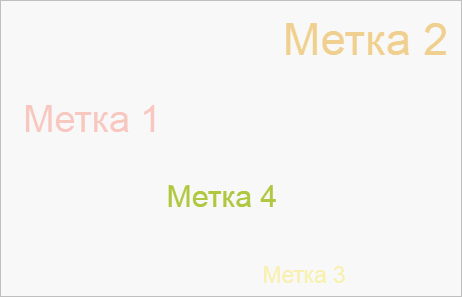

# Пример создания компонента TagCloud

Пример создания компонента TagCloud
-

# Пример создания компонента TagCloud

Для выполнения примера необходимо наличие на html-странице ссылок на
 файлы сценариев PP.js, PP.GraphicsBase.js, PP.TagCloud.js и файл стилей
 PP.css, в теге <body> html-страницы элемента 
 с идентификатором
 «tagCloud». В событие onload тега <body> необходимо добавить вызов
 функции createTagCloud(). Добавим на html-страницу облако меток:

function createTagCloud() {
    // Данные для создания облака меток
    data = new PP.DataSource({
        Title: "DataSource",
        AttributesNames: {
            color: "Color",
            size: "Size",
            value: "Value"
        },
        Series: {
            "Tag1": {
                color: {
                    Items: [10.0]
                },
                size: {
                    Items: [50]
                }
            },

            "Tag2": {
                color: {
                    Items: [20.0]
                },
                size: {
                    Items: [60]
                }
            },
            "Tag3": {
                color: {
                    Items: [30.0]
                },
                size: {
                    Items: [30]
                }
            },

            "Tag4": {
                color: {
                    Items: [40.0]
                },
                size: {
                    Items: [40]
                }
            }
        }
    });
    scales = new PP.ScaleBase({
        Id: "Scale0",
        Values: [10.0, 20.0, 30.0, 40.0, 50.0],
        Items: ["#FFFF462C", "#FFEBAF36", "#FFFFD900", "#FFB1CA40", "#FF6A8535"],
        EnableEquality: false,
        NoData: "#FFBFBFBF",
        TypeArguments: "Brush"

    });
    color = new PP.ColorVisual({
        ColorMapping: new PP.DataMapping({
            DataSource: null,
            DimAttributeId: "color",
            Type: "Scale",
            Index: 0,
            DataSource: data,
            Scale: scales
        })
    });
    size = new PP.SizeVisual({
        NumericMapping: new PP.DataMapping({
            DimAttributeId: "size",
            Type: "None",
            Index: 0,
            DataSource: data
        })

    });
    // Создаем облако меток
    tagCloud = new PP.Ui.TagCloud({
        // Устанавливаем родительский элемент
        ParentNode: document.getElementById("tagCloud"),
        // Устанавливаем визуализаторы
        Visuals: { ColorVisual: color, SizeVisual: size },
        // Устанавливаем размеры облака меток
        Width: 500,
        Height: 300,
        // Устанавливаем метки
        ItemsNames: { Tag1: "Метка 1", Tag2: "Метка 2", Tag3: "Метка 3", Tag4: "Метка 4" },
        // Устанавливаем источник данных

        DataSources: [data],
        // Устанавливаем признак движения меток по зажатию кнопки мыши
        IsDragControl: true,
        // Устанавливаем возможность масштабирования с помощью колесика мыши
        IsWheelZoom: true,
        // Устанавливаем сортировку элементов
        SortItems: true
    });
    // Устанавливаем цилиндрическую форму разброса элементов
    tagCloud.setShape("Cylinder");
}
В результате на страницу будет добавлено облако меток:

Выводим список заголовков элементов, которые содержаться в облаке меток:

// Выводим заголовки элементов:
console.log("Элементы: ");
var items = tagCloud.getItemsNames();
for (i in items) {
    console.log(items[i]);
}
В результате в консоль будут выведены заголовки элементов облака меток:

Элементы:

Метка 1

Метка 2

Метка 3

Метка 4

См. также:

[TagCloud](TagCloud.htm)

		Справочная
		 система на версию 10.9
		 от 18/08/2025,
		 © ООО «ФОРСАЙТ»,
