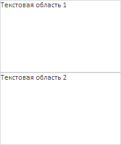

# Пример создания компонента TextArea

Пример создания компонента TextArea
-

# Пример создания компонента TextArea

Для выполнения примера необходимо создать html-страницу и выполнить
 следующие действия:

1. Добавить ссылки на файлы PP.css и PP.js.

2. Затем в теге <head> дополнительно установить стиль для элемента
 с идентификатором «TL»:

2. Внутри тега <body> разместить блок с идентификатором «TL» :

3. Далее на страницу внутри тега <body> необходимо добавить сценарий,
 который создаёт текстовые поля:

Для выполнения пользовательских сценариев над текстовыми полями, в том
 числе примеров, приведённых на страницах описания свойств, методов и событий
 данного компонента, требуется разместить код либо после указанного
 выше сценария, либо в консоли браузера.

4. В конце документа вставляем код, устанавливающий стили к вершине
 «document.body», соответствующие операционной системе клиента:

В результате выполнения примера на html-странице будет размещено два
 компонента PP.Ui.[TextArea](TextArea.htm). В компоненте textArea1
 доступен текстовый ввод, а в компоненте textArea2 - не доступен.

См. также:

[TextArea](TextArea.htm)

		Справочная
		 система на версию 10.9
		 от 18/08/2025,
		 © ООО «ФОРСАЙТ»,
