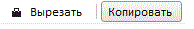

# Пример создания компонента ToolBar

Пример создания компонента ToolBar
-

# Пример создания компонента ToolBar

Для выполнения примера подключите библиотеку компонентов PP.js и таблицы визуальных стилей PP.css. Далее приведен javascript-код, при помощи которого создается компонент [ToolBar](ToolBar.htm). Необходимо наличие файла с наименованием «ui-icons_222222_256x240.png», содержащего набор пиктограмм для кнопок.

После выполнения примера на html-странице будет размещена панель инструментов с двумя кнопками:

См. также:

[ToolBar](ToolBar.htm)

		Справочная
		 система на версию 10.9
		 от 18/08/2025,
		 © ООО «ФОРСАЙТ»,
