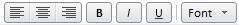

# ToolBarSeparator

ToolBarSeparator
-

# ToolBarSeparator

## Описание

Компонент ToolBarSeparator представляет собой разделитель между элементами [панели инструментов](../ToolBar/ToolBar.htm).

## Комментарии

Компонент реализован классом [ToolBarSeparator](../../Classes/ToolBarSeparator/ToolBarSeparator.htm).

## Пример

В данном примере на панели инструментов между двумя крайними кнопками справа размещен разделитель в виде линии.

См. также:

[DHTML-компоненты](dhtml.chm::/DHTML_components.htm)

		Справочная
		 система на версию 10.9
		 от 18/08/2025,
		 © ООО «ФОРСАЙТ»,
