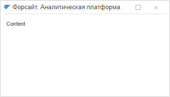
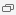

# Пример создания компонента Window

Пример создания компонента Window
-

# Пример создания компонента Window

Для выполнения примера необходимо создать html-страницу и выполнить
 следующие действия:

1. Добавить ссылки на файлы PP.css и PP.js.

2. В папку с примером добавить файл с наименованием «icon.png»:

2. Внутри тега <body> разместить блок с идентификатором «wnd»:

3. Далее на страницу внутри тега <body> добавить сценарий, создающий
 компонент [Window](Window.htm):

После выполнения примера на html-странице было отображено окно:

Оно расположено в центре страницы, поскольку для метода [show](../../Classes/DropPanel/DropPanel.show.htm)
 заданы параметры по умолчанию.

При нажатии на кнопку  размеры окна увеличатся:
 ширина будет равна 1000 пикселям, а высота - 700 пикселям. Кнопка приобретет
 следующий вид :. После нажатия на неё размеры
 окна вновь уменьшатся.

См. также:

[Window](Window.htm)

		Справочная
		 система на версию 10.9
		 от 18/08/2025,
		 © ООО «ФОРСАЙТ»,
