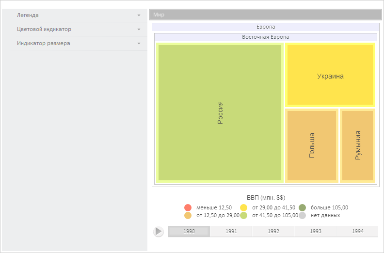

# TreeChartMaster.DataView

TreeChartMaster.DataView
-

**

# TreeChartMaster.DataView

## Синтаксис

DataView: Object

## Описание

Свойство DataView** определяет
 источник данных мастера.

## Комментарии

Значение свойства устанавливается из JSON и с помощью метода set**Caption**,
 а возвращается с помощью метода get**Caption**.
 Метод setCaption имеет следующие
 параметры: value - представление
 источника данных, clearOld - признак,
 определяющий, будут ли очищены добавленные ранее представления. По умолчанию
 равен true.

## Пример

Для выполнения примера предполагается наличие на странице компонента
 [TreeMap](dhtmlBubbleTree.chm::/Components/TreeMap/TreeMap.htm)
 с наименованием «treeMap» и компонента [TreeMapMaster](dhtmlBubbleTree.chm::/Components/TreeMapMaster/TreeMapMaster.htm)
 с наименованием «treeMapMaster» (см. «[Пример
 размещения компонентов TreeMapMaster и TreeMap](dhtmlBubbleTree.chm::/Components/TreeMapMaster/TreeMapMaster_and_TreeMap.htm)» ). Обработаем событие
 [PropertyChanged](TreeChartMaster.PropertyChanged.htm), установим
 новый объект, представляющий источник данных мастера с измененным свойством
 прозрачности, выведем идентификаторы панелей управления цветами, легендой
 и размерами:

// Обработаем событие PropertyChanged
treeMapMaster.PropertyChanged.add(function (sender, args, timeout) {
    console.log("Инициировано событие PropertyChanged")
});
// Получим объект, представляющий источник данных мастера
var dataView = treeMapMaster.getDataView();
// Изменим прозрачность полученного объекта
dataView[0].setOpacity(0.7);
// Установим новый объект, представляющий источник данных мастера
treeMapMaster.setDataView(dataView, true);
// Вызовем событие
treeMapMaster.PropertyChanged.fire(this);
// Получим панель управления цветами
var colorPanel = treeMapMaster.getColorPanel();
// Выведем идентификатор панели
console.log("Идентификатор панели управления цветами: " + colorPanel.getId());
// Получим панель управления легендой
var legendPanel = treeMapMaster.getLegendPanel();
// Выведем идентификатор панели
console.log("Идентификатор панели управления легендой: " + legendPanel.getId());
// Получим панель управления размерами
var sizePanel = treeMapMaster.getSizePanel();
// Выведем идентификатор панели
console.log("Идентификатор панели управления размерами: " + sizePanel.getId());

В результате выполнения примера была изменена прозрачность объекта,
 представляющего источник данных мастера:

Также в консоли браузера было выведено сообщение о вызове обработанного
 события, были выведены идентификаторы панелей управления цветами, легендой
 и размерами:

Инициировано событие PropertyChanged

Идентификатор панели управления цветами: TreeColorPanel762

Идентификатор панели управления легендой: TreeLegendPanel632

Идентификатор панели управления размерами: TreeSizePanel892

См. также:

 [TreeChartMaster](TreeChartMaster.htm)

		Справочная
		 система на версию 10.9
		 от 18/08/2025,
		 © ООО «ФОРСАЙТ»,
