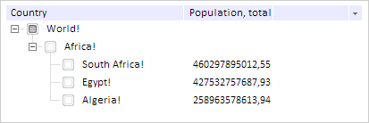

# TreeColumn.FormatMethod

TreeColumn.FormatMethod
-

# TreeColumn.FormatMethod

## Синтаксис

FormatMethod: Function

## Описание

Свойство FormatMethod устанавливает
 функцию, предназначенную для форматирования элементов столбца.

## Комментарии

Значение свойства устанавливается из JSON и с помощью метода setFormatMethod,
 а возвращается с помощью метода getFormatMethod.

## Пример

Для выполнения примера необходимо наличие на html-странице ссылок на
 файл сценария PP.js и файл стилей PP.css, в теге <body> html-страницы
 элемента 
 с идентификатором «treeList». В событии onload тега
 <body> необходимо указать вызов функции createTreeList(). Создадим
 иерархическое дерево:

function createTreeList() {
    column = new PP.Ui.TreeColumn({
        // Устанавливаем метод для форматирования содержимого столбца
        FormatMethod: function (value) {
            return value + "!"
        },
        // Устанавливаем возможность редактирования столбца
        Editable: true,
        // Устанавливаем возможность скрытия столбца
        Hideable: true,
        // Устанавливаем активность столбца
        IsEnabled: true,
        // Устанавливаем тип содержимого столбца
        Type: PP.Ui.TreeColumnType.string,
        Caption: "Country",
        Width: 200,
        MinWidth: 50,
        Visible: true,
    });
    treeList = new PP.Ui.TreeList({
        // Устанавливаем родительский элемент
        ParentNode: document.getElementById('treeList'),
        // Устанавливаем отображение заголовков столбцов
        CaptionVisible: true,
        // Включаем отображение флажков у вершин
        CheckBoxes: true,
        // Устанавливаем возможность изменения ширины столбцов
        EnableResizeColumn: true,
        // Устанавливаем отображение столбцов
        ShowColumns: true,
        // Устанавливаем видимость пиктограммы меню для возможности редактирования видимости столбцов
        EnableColumnsMenu: true,
        // Устанавливаем размеры компонента
        Height: 125,
        Width: 400,
        // Столбцы
        Columns: [
            column, {
                Caption: "Population, total",
                Width: 100,
                MinWidth: 50,
                Visible: true
            }, {
                Caption: "GDP, PPP",
                Width: 100,
                MinWidth: 50,
                Visible: false
            }, {
                Caption: "GPD per capita, PPP",
                Width: 100,
                MinWidth: 10,
                Visible: false
            }
        ],
        // Вершины:
        Nodes: [{
            Text: "World",
            Columns: ["", "", ""],
            ImageIndex: 1,
            Selected: false,
            CanSelect: true,
            Value: "TestValue",
            Expanded: false,
            Checked: true,
            Nodes: [{
                Text: "Africa",
                Columns: [],
                Selected: false,
                CanSelect: true,
                Value: "TestValue",
                Expanded: true,
                Checked: false,
                Nodes: [{
                    Text: "South Africa",
                    Columns: ["460297895012,55", "9332,86", "49320150,00"],
                    ImageUrl: null,
                    ImageIndex: 0,
                    Selected: false,
                    CanSelect: true,
                    Value: "TestValue",
                    Expanded: true,
                    Checked: false
                }, {
                    Text: "Egypt",
                    Columns: ["427532757687,93", "5151,03", "82999393,00"],
                    ImageUrl: null,
                    ImageIndex: 1,
                    Selected: false,
                    CanSelect: true,
                    Value: "TestValue",
                    Expanded: true,
                    Checked: false
                }, {
                    Text: "Algeria",
                    Columns: ["258963578613,94", "7421,12", "34895470,00"],
                    ImageUrl: null,
                    ImageIndex: 2,
                    Selected: false,
                    CanSelect: true,
                    Value: "TestValue",
                    Expanded: true,
                    Checked: false
                }]
            }]
        }],
    });
    // Раскрываем все вершины дерева
    column.getOwner().expandAll();
}
В результате будет создано иерархическое дерево, у которого все элементы
 столбца с наименованием «Country» будут иметь в названии символ «!»:

См. также:

[TreeColumn](TreeColumn.htm)

		Справочная
		 система на версию 10.9
		 от 18/08/2025,
		 © ООО «ФОРСАЙТ»,
