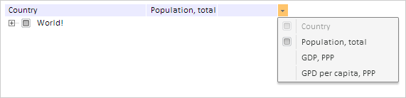

# TreeColumn.Hideable

TreeColumn.Hideable
-

# TreeColumn.Hideable

## Синтаксис

Hideable: Boolean

## Описание

Свойство Hideable определяет
 возможность скрытия столбца.

## Комментарии

Допустимые значения:

	- true.
	 Скрытие столбца разрешено (по умолчанию);

	- false.
	 Скрытие столбца запрещено.

Значение свойства устанавливается из JSON и с помощью метода setHideable,
 а возвращается с помощью метода getHideable.

## Пример

Для выполнения примера предполагается наличие на странице компонента
 [TreeList](../../Components/TreeList/TreeList.htm) c наименованием
 «treeList» (см. «[Пример
 создания компонента TreeList](../../Components/TreeList/TreeList_example.htm)»). Пример запускается в консоли браузера.
 Установим первому столбцу дерева признак невозможности скрытия:

// Устанавливаем первому столбцу дерева признак невозможности скрытия
treeList.getColumns().getItem(0).setHideable(false);
В результате скрыть первый столбец будет невозможно:

См. также:

[TreeColumn](TreeColumn.htm)

		Справочная
		 система на версию 10.9
		 от 18/08/2025,
		 © ООО «ФОРСАЙТ»,
