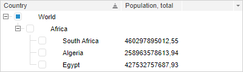

# TreeColumn.SortMethod

TreeColumn.SortMethod
-

# TreeColumn.SortMethod

## Синтаксис

SortMethod: Function

## Описание

Свойство SortMethod устанавливает
 функцию, предназначенную для сортировки элементов столбца.

## Комментарии

Значение свойства устанавливается из JSON и с помощью метода setSortMethod,
 а возвращается с помощью метода getSortMethod.

## Пример

Для выполнения примера предполагается наличие на странице компонента
 [TreeList](../../Components/TreeList/TreeList.htm) c наименованием
 «treeList» (см. «[Пример
 создания компонента TreeList](../../Components/TreeList/TreeList_example.htm)»). Установим новый метод сортировки для
 первого столбца дерева, который будет сортировать элементы по второму
 символу их содержимого:

// Получим первый столбец дерева
var column = treeListSett.getColumns().getItem(0);
// Установим новый метод сортировки
column.setSortMethod(function (nodeA, nodeB, params) {
    if (nodeA.Text.charAt(1) < nodeB.Text.charAt(1)) {
        return 1;
    } else {
        return -1;
    }
    return 0
});
treeListSett.update();

После выполнения примера при нажатии на заголовок первого столбца элементы
 будут отсортированы по второму символу их содержимого:

См. также:

[TreeColumn](TreeColumn.htm)

		Справочная
		 система на версию 10.9
		 от 18/08/2025,
		 © ООО «ФОРСАЙТ»,
